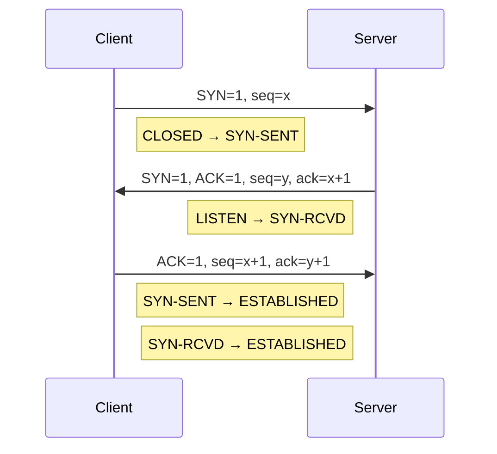

# TCP 三次握手

## 核心定义

TCP 三次握手 是建立 TCP 可靠连接的过程，三次报文交互序列为：**SYN $\to$ SYN+ACK $\to$ ACK**。

三次握手的目的：**确认双方收发能力**、**协商初始序号（ISN）**、**建立可靠连接状态**。

三次握手不是"形式主义"，核心必要性在于避免 历史报文 导致错误连接，并让双方都确认对方在线且可通信——本质是完成**双向确认**。

TCP 是 面向连接 的可靠传输协议，连接建立阶段需要完成状态迁移，三次握手完成后双方进入 **ESTABLISHED** 状态。

三次握手状态变化：客户端 **CLOSED $\to$ SYN-SENT $\to$ ESTABLISHED**；服务端 **CLOSED $\to$ LISTEN $\to$ SYN-RCVD $\to$ ESTABLISHED**。

SYN 洪泛攻击 是攻击者发送大量伪造源 IP 的 SYN 报文，使服务端 半连接队列 耗尽，正常连接无法建立。防御手段包括 **SYN Cookie** 和调整半连接队列大小。

## 关键细节 / 操作步骤

1. 第一次握手：客户端发送 **SYN=1, seq=x**，进入 **SYN-SENT** 状态，表明请求建立连接并携带客户端初始序号。
2. 第二次握手：服务端返回 **SYN=1, ACK=1, seq=y, ack=x+1**，进入 **SYN-RCVD** 状态，同时确认客户端序号并告知自己的初始序号。
3. 第三次握手：客户端发送 **ACK=1, seq=x+1, ack=y+1**，进入 **ESTABLISHED** 状态，确认服务端序号，连接正式建立。
4. 为什么不是两次：两次握手无法让客户端确认服务端已收到自己的确认，且**历史旧报文可能被服务端误认为新连接请求**，导致资源浪费。
5. 为什么不是四次：SYN 和 ACK 可以合并（第二次握手同时完成确认和发起），因此三次恰好够用。
6. 初始序号（ISN）：双方各自**独立随机选择**，不能从 0 或固定值开始，是为了防止历史报文序号重叠引发数据混淆。
7. SYN 洪泛攻击判断：题目出现"大量半连接""连接队列满""正常用户连不上"，联系 **SYN 洪泛** 和 **SYN Cookie 防御**。
8. 三次握手 vs 四次挥手：握手是**建立连接**（3 次），挥手是**释放连接**（4 次，因为 FIN 和 ACK 分开发送）。
9. 若题目问报文语义：SYN 表示"**我要建立连接**"，ACK 表示"**我确认收到了**"，两者在第二次握手中合并表达。
10. 若题目问握手后是否立刻传数据：三次握手完成后双方状态同步，**可以立即开始数据传输**（第三次 ACK 可携带数据）。

> **⚠️ 易错辨析**
> - 第三次握手不是多余的：它确认服务端已收到客户端的确认，避免"**单向可达**"被误判为"连接成功"。反例：若只有两次握手，客户端发的旧 SYN 到达服务端后，服务端分配资源等待，但客户端并不想连接——资源白白浪费。
> - 三次握手建立的是**连接状态**，不代表应用层已开始传输业务数据，但第三次 ACK 可以携带数据。
> - SYN 和 ACK 语义不同：SYN 是"**请求同步**", ACK 是"**确认收到**"，不能只记报文顺序而不理解各自作用。
> - 初始序号不是从 0 或 1 开始，而是**随机生成**，目的是安全性（防序号预测攻击）和历史报文隔离。
> - 服务端在 SYN-RCVD 状态时已分配资源（半连接），此时若客户端不回 ACK，资源将被占用——这就是 SYN 洪泛攻击的原理。

> **💡 技巧与口诀**
> - 口诀：**客户端先问（SYN），服务端再答（SYN+ACK），客户端最后确认（ACK）**。
> - 应用场景：看到"连接建立""初始序号""半连接队列"这些关键词，直接往三次握手和 SYN 状态上靠。
> - 解释"三次"的必要性：核心是"**双方都要确认对方收到了自己的确认**"——两次只能单向确认。
> - 区分握手和挥手：握手是**建立连接**（合并 SYN+ACK），挥手是**释放连接**（FIN 和 ACK 分开）。

> **📝 真题闭环**
> 题目：主机 A 向主机 B 发起 TCP 连接，A 的初始序号 seq = 200，B 的初始序号 seq = 500。请写出三次握手过程中每次报文的 seq 和 ack 值，以及每步完成后双方的 TCP 状态。
>
> **解题思路**：
> - 审题抓"三次握手报文参数"，切入点是**序号和确认号的变化规则**。
> - 第一次：A $\to$ B，**SYN=1, seq=200, ack=0**。A 状态：CLOSED $\to$ **SYN-SENT**；B 状态：LISTEN。
> - 第二次：B $\to$ A，**SYN=1, ACK=1, seq=500, ack=201**（确认号 = 收到序号 + 1）。B 状态：LISTEN $\to$ **SYN-RCVD**。
> - 第三次：A $\to$ B，**ACK=1, seq=201, ack=501**。A 状态：SYN-SENT $\to$ **ESTABLISHED**；B 状态：SYN-RCVD $\to$ **ESTABLISHED**。
> - 关键规则：确认号 ack = 对方 seq + 1（SYN 占一个序号）。
>
> 答案：第一次 **seq=200, ack=0**；第二次 **seq=500, ack=201**；第三次 **seq=201, ack=501**。最终双方进入 **ESTABLISHED** 状态。
