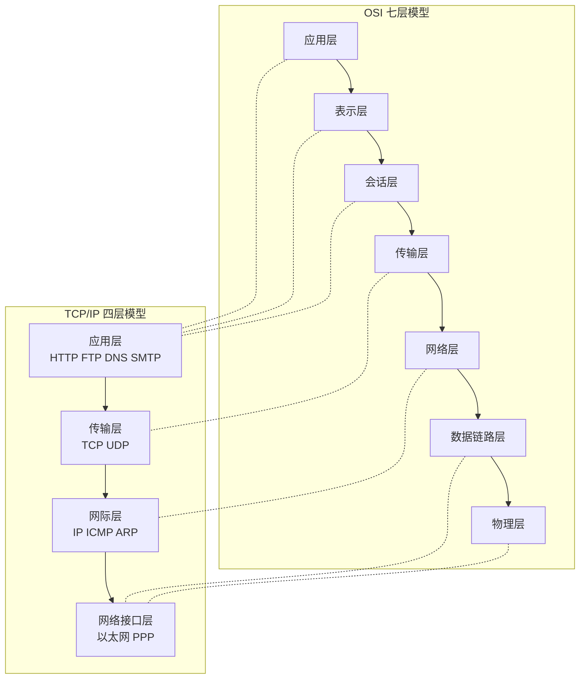

# OSI 与 TCP-IP 模型

## 核心定义

OSI 七层模型 是国际标准化组织提出的理论参考模型，从下到上依次为：**物理层、数据链路层、网络层、传输层、会话层、表示层、应用层**。

TCP/IP 模型 是工程实践中广泛使用的四层体系：**网络接口层、网际层、传输层、应用层**。

分层的核心意义：**解耦协议设计、统一层间接口、便于异构网络互联**。三大好处关键词：**标准化、互操作性、可维护性**。

OSI 与 TCP/IP 的对应关系：OSI 的**会话层和表示层**在 TCP/IP 中被合并到**应用层**；OSI 的物理层和数据链路层对应 TCP/IP 的**网络接口层**；网络层和传输层一一对应。

各层核心功能与典型协议：
- 应用层：**HTTP、FTP、DNS、SMTP、POP3** —— 提供用户网络服务接口。
- 传输层：**TCP（可靠、面向连接）、UDP（不可靠、无连接）** —— 端到端通信，**端口寻址**。
- 网络层：**IP、ICMP、ARP、路由协议** —— 跨网络**寻址与路由转发**。
- 数据链路层：**以太网、PPP、MAC 寻址、成帧** —— 相邻节点可靠传输，**差错检测**。
- 物理层：**比特流传输、电气信号规范** —— 定义传输介质和信号编码。

ARP 协议功能：将 **IP 地址解析为 MAC 地址**，工作在数据链路层/网络层边界，408 中通常归为网络层。

ICMP 协议功能：用于网络层**差错报告和查询**，如 ping 命令基于 ICMP 回送请求/应答报文。

数据链路层与物理层的核心区别：链路层管**成帧、MAC 寻址、差错检测**；物理层管**比特流传输、信号编码、传输介质规范**。

网络层与传输层的核心区别：网络层解决**主机到主机之间**的路由转发；传输层解决**进程到进程之间**的端到端通信。

## 关键细节 / 操作步骤

1. 辨认题目问的是 **OSI** 还是 **TCP/IP** 模型，再按对应层次作答。
2. 协议归属判断法：先看该协议解决什么问题——用户交互选**应用层**，端到端传输选**传输层**，路由转发选**网络层**，局域网帧传输选**数据链路层**。
3. OSI 七层功能速记：**物理传比特，链路传帧，网络寻路，传输端到端，会话管理对话，表示编码加密，应用服务用户**。
4. TCP/IP 四层映射：应用层对应 OSI 上三层（**应用+表示+会话**），传输层一一对应，网际层对应 OSI 网络层，网络接口层对应 OSI 下两层（**链路+物理**）。
5. 链路层与物理层区分：链路层管**成帧、MAC 寻址、差错检测**；物理层管**比特流传输、信号编码、传输介质规范**。
6. 网络层与传输层区分：网络层解决**主机到主机之间**的路由转发；传输层解决**进程到进程之间**的端到端通信。
7. TCP 与 UDP 区分：TCP 提供**可靠、面向连接、字节流**传输；UDP 提供**不可靠、无连接、数据报**传输。
8. ARP 协议功能：将 **IP 地址解析为 MAC 地址**，工作在数据链路层/网络层边界。
9. 若题目要求画体系结构：先画大层次框架，再补充每层的典型协议。
10. 若题目问"为什么不能死背层号"：因为同一功能在不同模型中的**归属方式不完全一致**，应按功能映射而非层号记忆。

> **⚠️ 易错辨析**
> - OSI 七层不必与 TCP/IP 四层一一对应，考试更看重**功能映射**而非层数对照。若强行一一映射会遗漏会话层和表示层的归属。
> - 会话层、表示层在 TCP/IP 中**被合并到应用层**，不要在 TCP/IP 模型中单独列出。
> - 网络层 $\neq$ 传输层：前者管**主机间路由转发**（跨网络），后者管**进程间端到端通信**（端口寻址）。反例：IP 是网络层协议，不能说它提供端到端服务。
> - "分层"不等于"绝对隔离"：各层之间通过**接口**交互，协议栈之间有协同关系。
> - 传输层"端到端"中的"端"指**端口（Port）**，不是物理终端。
> - ARP 不是单纯的数据链路层协议：它将**IP 地址映射为 MAC 地址**，涉及网络层地址，408 中通常归为网络层。

> **💡 技巧与口诀**
> - 口诀：**上层管应用，中层管传输，下层管转发和成帧**。
> - 应用场景：看到"网页访问"想 **HTTP（应用层）**，"可靠传输"想 **TCP（传输层）**，"路由寻址"想 **IP（网络层）**，"帧传输"想 **以太网（链路层）**。
> - 对比 OSI 和 TCP/IP：先写"**七层理论 vs 四层实践**"，再展开功能映射。
> - 分层好处三关键词：**标准化、互操作性、可维护性**。
> - 协议归类题策略：先看功能（**用户服务/端到端/路由/成帧/比特**），再映射到层次。

> **📝 真题闭环**
> 题目：请将以下协议/概念归类到 OSI 七层模型中：HTTP、TCP、IP、以太网帧、ARP、比特流、DNS、UDP。
>
> **解题思路**：
> - 审题抓"协议归类"，切入点是**按功能定位层次**。
> - 应用层：**HTTP、DNS**（提供用户服务）。
> - 传输层：**TCP、UDP**（端到端通信，端口寻址）。
> - 网络层：**IP、ARP**（IP 负责寻址转发，ARP 将 IP 解析为 MAC 地址，处于网络层与链路层边界，408 中通常归为网络层）。
> - 数据链路层：**以太网帧**（成帧、MAC 寻址）。
> - 物理层：**比特流**（信号与传输介质）。
>
> 答案：应用层—**HTTP、DNS**；传输层—**TCP、UDP**；网络层—**IP、ARP**；数据链路层—**以太网帧**；物理层—**比特流**。
