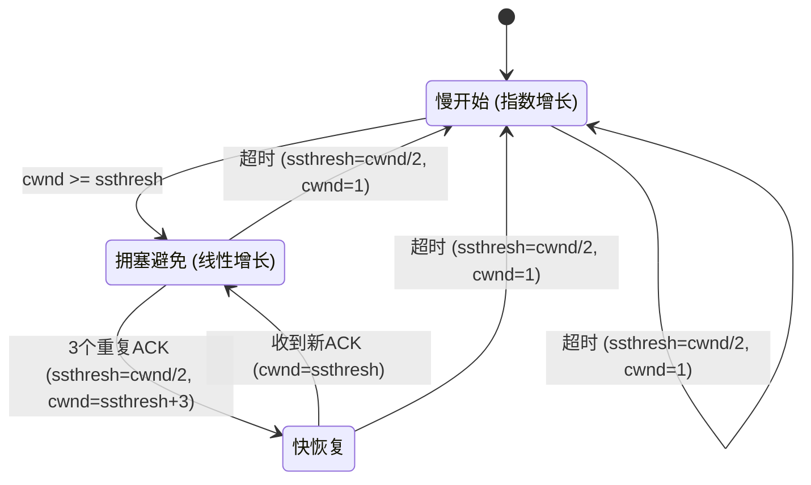

# TCP 拥塞控制

## 核心定义

TCP 拥塞控制 是 TCP 通过动态调节发送速率来**避免网络整体过载**的一套机制，目标是让整个网络维持在可承受、可恢复、可持续的状态。

核心变量：cwnd（拥塞窗口）决定发送方在未收到确认前最多可发的数据量；ssthresh（慢开始门限）用于区分 **慢开始阶段** 与 **拥塞避免阶段**。

四个核心算法：慢开始（**指数增长探测可用容量**）、拥塞避免（**线性增长稳定逼近上限**）、快重传（**收到三个重复 ACK 立即重传**）、快恢复（**重传后不回到慢开始而是适度降窗**）。

拥塞控制 $\neq$ 流量控制：拥塞控制管的是**网络整体负载**，流量控制管的是**接收方缓存**，两者目的不同不能混淆。

慢开始阶段：每收到一个 ACK，cwnd 增加 **1 个 MSS**，效果为每个 RTT 窗口近似**翻倍（指数增长）**。

拥塞避免阶段：每个 RTT 内 cwnd 近似增加 **1 个 MSS（线性增长）**，平稳逼近网络容量。

触发信号分类：**三个重复 ACK** $\to$ 轻度拥塞 $\to$ 快重传 + 快恢复；**超时** $\to$ 严重拥塞 $\to$ cwnd 降为 1 MSS，回到慢开始。

从工程角度，拥塞控制本质是**试探式增速**与**拥塞反馈退让**的平衡。

## 关键细节 / 操作步骤

1. 阶段判断：若 **cwnd < ssthresh** 则处于**慢开始阶段**；若 **cwnd $\geq$ ssthresh** 则进入**拥塞避免阶段**。
2. 慢开始增长规则：每收到一个 ACK，cwnd += **1 MSS**（等效每 RTT 翻倍），常写作 $cwnd = cwnd \times 2$。
3. 拥塞避免增长规则：每收到一个 ACK，cwnd += **$\frac{1}{cwnd}$ MSS**（等效每 RTT 增加 1 MSS），常写作 $cwnd = cwnd + 1$。
4. 收到三个重复 ACK 时（快重传）：ssthresh = **cwnd / 2**，cwnd = **ssthresh + 3 MSS**，立即重传丢失报文，进入快恢复阶段。
5. 快恢复阶段：收到新 ACK 后，cwnd = **ssthresh**，转入拥塞避免继续线性增长。
6. 超时事件：ssthresh = **cwnd / 2**，cwnd = **1 MSS**，回到慢开始从头指数增长。
7. 画窗口变化图时：先标注**阈值点（ssthresh）**、**丢包点**、**恢复点**，再填写各段增长方式（指数/线性/骤降）。
8. 若题目给窗口变化序列：按"**增、降、恢复**"三段识别所处阶段。
9. 若题目问"cwnd 和 rwnd 的关系"：实际发送窗口 = **min(cwnd, rwnd)**，rwnd 是接收方通告的流量控制窗口。
10. 若题目给事件序列求 cwnd：先分类事件类型（重复 ACK / 超时 / 正常），再套增长规则逐步计算。

> **⚠️ 易错辨析**
> - 流量控制 $\neq$ 拥塞控制：流量控制基于 **rwnd** 保护接收方缓存；拥塞控制基于 **cwnd** 保护网络整体。实际窗口 = min(cwnd, rwnd)。
> - 三个重复 ACK $\neq$ 超时：重复 ACK 表示**个别丢包（轻度拥塞）**，触发快重传；超时表示**严重拥塞**，cwnd 直接降到 1 MSS。两者处理方式完全不同。
> - "窗口越大越好"是错误的：窗口过大导致网络排队加剧、丢包增多，反而降低吞吐。
> - 达到 ssthresh 后仍指数增长是错误的，必须转入**线性增长**（拥塞避免）。这是常考错误选项。
> - 快重传关注"**尽快发现局部丢包**"，快恢复关注"**避免窗口回到过低水平**"——两者配合使用，缺一不可。

> **💡 技巧与口诀**
> - 口诀：**慢开始指数冲，拥塞避免线性行，三重复 ACK 快重传，超时回到慢开始**。
> - 看到"阈值前"先想 **指数增长**，看到"阈值后"先想 **线性增长**。
> - 应用场景：窗口变化图题 $\to$ 先标关键点再填曲线；阶段判断题 $\to$ 看 cwnd 与 ssthresh 大小关系；丢包处理题 $\to$ 先区分信号类型再套规则。
> - 与计网其他题相比，拥塞控制题更看重**过程判断**而不是复杂运算。

> **📝 真题闭环**
> 题目：TCP 连接建立后 cwnd = 1 MSS，ssthresh = 16 MSS。假设无丢包，写出前 5 个 RTT 后 cwnd 的值。若第 5 个 RTT 后收到三个重复 ACK，cwnd 和 ssthresh 如何变化？
>
> **解题思路**：
> - 审题抓"cwnd 逐步增长 + 重复 ACK 处理"，切入点是**慢开始指数增长规则**。
> - RTT 1：cwnd = 1 MSS（初始），cwnd < ssthresh，慢开始。
> - RTT 2：cwnd = **2 MSS**（翻倍）。
> - RTT 3：cwnd = **4 MSS**。
> - RTT 4：cwnd = **8 MSS**。
> - RTT 5：cwnd = **16 MSS**（= ssthresh，下一个 RTT 转入拥塞避免）。
> - 收到三个重复 ACK：ssthresh = cwnd / 2 = **8 MSS**，cwnd = ssthresh + 3 = **11 MSS**（快重传），进入快恢复。
> - 收到新 ACK 后：cwnd = ssthresh = **8 MSS**，转入拥塞避免线性增长。
>
> 答案：5 个 RTT 后 cwnd = **16 MSS**；收到三个重复 ACK 后 ssthresh = **8 MSS**，cwnd = **11 MSS**。
