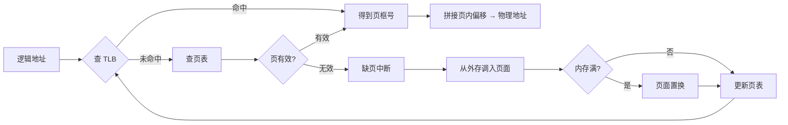

# 内存管理

## 核心定义

内存管理 研究主存的分配、保护、共享和扩充，核心围绕**地址转换、空间分配、缺页处理**三条主线。

页式存储 将逻辑地址空间按固定大小划分为**页面**，物理空间划分为**页框**，通过 页表 建立页号到页框号的映射。逻辑地址结构：$$\text{逻辑地址} = \text{页号} + \text{页内偏移}$$

段式存储 按程序逻辑模块划分**段**，每段有独立的段号和段内偏移，便于**按模块保护和共享**。

段页式存储 先分段再分页，结合两者优点：段提供**逻辑意义**，页提供**离散分配**。

TLB（快表）是页表的高速缓存，缓存**最近使用的页表项**，减少访问主存页表的次数，加速地址转换。

虚拟存储器 基于 局部性原理，使程序可使用比物理内存更大的逻辑地址空间，访问不在内存的页面时触发 缺页中断。

页面置换算法 当内存满时决定淘汰哪一页：**OPT**（理论最优）、**FIFO**（先入先出，可能 Belady 异常）、**LRU**（最近最少使用，具有堆栈特性）、**Clock**（近似 LRU）。

分页可能产生**内部碎片**（页内浪费），分段可能产生**外部碎片**（段间空洞）。

## 关键细节 / 操作步骤

1. 地址转换流程：先判地址为**逻辑地址**还是**物理地址**，再确定采用分页/分段/段页式。
2. 分页地址转换：**页号查页表得到页框号**，拼接页内偏移得到物理地址。
3. TLB 加速：先查**快表（TLB）**，命中则直接得到页框号；未命中则查**主存页表**，同时更新 TLB。
4. 缺页处理流程：**查页表发现无效位** $\to$ **触发缺页中断** $\to$ **从外存调入页面** $\to$ **更新页表项** $\to$ **重新执行指令**。
5. 碎片判断：问内部碎片联想**分页**（页大小固定，末页可能不满）；问外部碎片联想**分段**（段大小可变，产生空洞）。
6. 保护与共享：优先联想**段式管理**（段与逻辑模块对应，便于按模块操作）。
7. 置换算法比较：按**命中率、实现难度、是否具有堆栈特性**三个维度展开。
8. 若题目给访问序列模拟置换：先确认**页框数**，再按规则逐步模拟，注意 FIFO 可能出现 Belady 异常（**页框增多反而缺页率上升**）。
9. 若题目问地址结构：先写页号/段号位数与偏移位数，再算寻址范围。
10. 若题目问缺页率影响因素：联系**页面大小、页框数、置换算法、程序局部性**。

> **⚠️ 易错辨析**
> - 页表是**映射关系**，不是内存本体；TLB 是**页表的缓存**，不是页表本身，更不是数据 Cache。
> - 缺页中断不是普通 I/O 中断，它属于**内中断（异常）**，与虚拟存储页面调入直接相关。
> - 分页 $\neq$ 无碎片：分页消除外部碎片但可能产生**内部碎片**；分段消除内部碎片但可能产生**外部碎片**。
> - 段页式不是简单叠加名词，而是**先分段再分页**的组合机制，地址结构为**段号 + 页号 + 页内偏移**。
> - FIFO 可能出现 Belady 异常（**更多页框反而更多缺页**），LRU 和 OPT 不会。
> - 局部性分为**时间局部性**（最近访问的数据可能再被访问）和**空间局部性**（相邻数据可能被连续访问），决定了 TLB 和页缓存的命中率。

> **💡 技巧与口诀**
> - 口诀：**分页看页号，分段看段义，段页先段后页**。
> - 应用场景：题目出现"地址转换""缺页中断""页面置换"，按**虚拟内存链路**梳理：逻辑地址 $\to$ 查 TLB $\to$ 查页表 $\to$ 缺页处理 $\to$ 置换 $\to$ 重试。
> - 若题目问碎片：先区分内部/外部，再回到具体管理方式。
> - 比较分页和分段最稳妥写法：**分页便于离散分配、分段便于逻辑保护、段页式兼顾两者**。

> **📝 真题闭环**
> 题目：在一个采用请求分页存储管理的系统中，某进程的页面访问序列为 1,2,3,4,1,2,5,1,2,3,4,5。分配 3 个页框时，分别用 FIFO 和 LRU 算法计算缺页次数。
>
> **解题思路**：
> - 审题抓"FIFO 和 LRU 缺页次数"，切入点是**逐步模拟页面访问序列**。
> - FIFO：先装入的页面先淘汰，按队列顺序维护。3 个页框模拟结果：缺页次数 = **9** 次。
> - LRU：淘汰最近最久未使用的页面，按时间戳维护。3 个页框模拟结果：缺页次数 = **10** 次。
> - 注意本题 FIFO 比 LRU 缺页更少，说明 FIFO 不一定总是更差，但不能推广为一般结论。
> - 若分配 4 个页框，FIFO 缺页可能反而增多（**Belady 异常**），而 LRU 不会。
>
> 答案：FIFO 缺页 **9** 次，LRU 缺页 **10** 次。
