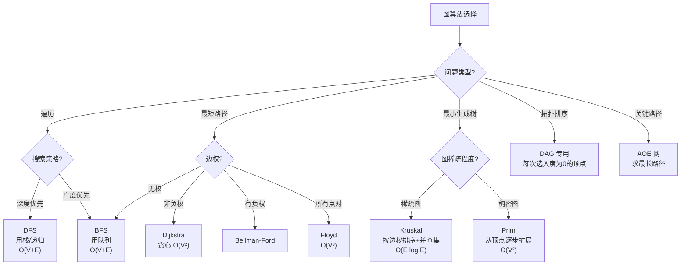

# 图

## 核心定义

图 由 **顶点集 $V$** 和 **边集 $E$** 构成，是非线性结构。图可以是有向或无向、带权或不带权、连通或非连通。

邻接矩阵 的空间复杂度为 **$O(V^2)$**，适合 **稠密图**（边多的图），判断两顶点是否相邻的时间为 **$O(1)$**。

邻接表 的空间复杂度为 **$O(V+E)$**，适合 **稀疏图**（边少的图），稀疏图更适合邻接表是因为 **只存实际存在的边，空间更省**。

图的遍历：DFS（深度优先搜索）使用 **栈** 或递归，时间复杂度 **$O(V+E)$**；BFS（广度优先搜索）使用 **队列**，时间复杂度 **$O(V+E)$**。DFS 产生 **深度优先生成树**，BFS 产生 **广度优先生成树**。

Dijkstra 算法适用于 **非负权图** 的单源最短路径，贪心本质，不适用于 **负权边**，邻接矩阵实现时间 **$O(V^2)$**。

Floyd 算法可求 **任意两点间最短路径**，时间复杂度 **$O(V^3)$**，可以处理负权边（但不能有 **负权回路**）。

最小生成树 关注 **全图连通且总权值最小**，使用 Kruskal 算法（适合稀疏图，时间 **$O(E \log E)$**，用 **并查集** 判环）或 Prim 算法（适合稠密图，时间 **$O(V^2)$**，从顶点逐步扩展）。

拓扑排序 用于 有向无环图（DAG），检测是否有 **回路**（回路则无法拓扑排序）。

关键路径 用于 AOE 网，求 **最长路径**（决定工程最短完成时间）。关键活动的松弛时间为 **0**，缩短关键活动可以 **缩短工期**。



## 关键细节 / 操作步骤

1. 先判图是 **有向/无向**、**带权/不带权**。
2. 再选存储方式：边少选 **邻接表**，边多选 **邻接矩阵**。
3. 访问类题优先 DFS/BFS，带权题再看 **Dijkstra/Floyd/Kruskal/Prim**。
4. 若问连通性，先看是否需要 **遍历所有顶点**；多个连通分量时 DFS/BFS 需 **从未访问顶点重新启动**。
5. 若问最短路径：无权图用 **BFS**，带权非负用 **Dijkstra**，有负权用 **Bellman-Ford**，所有点对用 **Floyd**。
6. 若问最小生成树，先区分 Kruskal（适合稀疏图，按 **边权排序**）和 Prim（适合稠密图，从 **一个顶点扩展**）。
7. 若问遍历，DFS 用 **栈/递归**，BFS 用 **队列**。
8. 若题目问存储复杂度，邻接矩阵 **$O(V^2)$**，邻接表 **$O(V+E)$**。
9. 若题目问拓扑排序，只能用于 **有向无环图**，结果不唯一——每次选 **入度为 0** 的顶点输出。
10. 若题目问关键路径，关键活动的延迟会影响 **整个工程工期**。
11. 图的题目常把"存储结构"和"算法选择"放在一起考，先 **分开分析** 再综合。
12. 若题目问无向连通图的生成树，边数为 **$V - 1$**，去掉任何一条边则 **不连通**。
13. 若题目问有向图顶点的度，要分别计算 **入度和出度**，无向图只需看一个度。
14. 若题目问邻接矩阵中非零元素个数，无向图为 **$2E$**（对称），有向图为 **$E$**。
15. 若题目问无向图的连通分量个数，用 DFS/BFS 从每个未访问顶点出发，启动次数即为 **连通分量数**。
16. 若题目问 Dijkstra 是否能求最长路径，答案是 **不能**，因为最长路径问题是 NP-hard 的。

> **⚠️ 易错辨析**
> BFS 和 DFS 的核心差别在数据结构（队列 vs 栈），不在"看起来像不像遍历"。Dijkstra 不能直接处理负权边——遇到负权边可能给出 **错误最短路径**。最小生成树和最短路径不是一回事：前者 **连接所有顶点并最小化总权值**，后者 **关注某源到某点的路径权值最小**。图的连通、强连通、弱连通是不同概念——强连通要求 **任意两点互相可达**。Kruskal 选边时若图不连通则 **无法生成一棵树**。反例：Dijkstra 遇到负权边时，已确定最短路径的顶点可能需要被重新松弛。

> **💡 技巧与口诀**
> 口诀：**稀疏表、稠密阵；无权最短路用 BFS，带权非负路看 Dijkstra**。适用场景：一看到"路径、连通、边权、生成树"就先把图的类型和问题目标分开。BFS 和 DFS 的区别重点在 **搜索顺序、使用结构、应用场景** 三方面。拓扑排序时每次选 **入度为 0 的顶点** 输出。关键路径上的活动是 **关键活动**，其松弛时间为 **0**。

> **📝 真题闭环**
> 题目：对带非负权值的有向图，从源点 s 出发求到其余各顶点的最短路径，应选什么算法？其时间复杂度是多少？若图中存在负权边呢？
>
> 解题思路：审题抓"带非负权值"和"单源最短路径"，切入点是 **Dijkstra 算法**；方法选择为贪心策略；计算关键点是每次选取 **当前最短路径的未访问顶点** 进行松弛；易错防范是误用于含负权边的图。
>
> 答案：应选 **Dijkstra 算法**，使用邻接矩阵时时间为 **$O(V^2)$**，使用邻接表+优先队列可优化为 **$O(E \log V)$**。若有负权边则改用 **Bellman-Ford 算法**。
>
> ```c
> // T=O(V^2) S=O(V)
> void Dijkstra(int dist[], int visited[], int graph[][MAX], int n, int s) {
>     for (int i = 0; i < n; i++) dist[i] = INF;
>     dist[s] = 0;
>     for (int i = 0; i < n; i++) {
>         int u = -1, min = INF;
>         for (int j = 0; j < n; j++)
>             if (!visited[j] && dist[j] < min) { u = j; min = dist[j]; }
>         if (u == -1) break;
>         visited[u] = 1;
>         for (int v = 0; v < n; v++)
>             if (!visited[v] && graph[u][v] != INF && dist[u] + graph[u][v] < dist[v])
>                 dist[v] = dist[u] + graph[u][v];
>     }
> }
> ```
