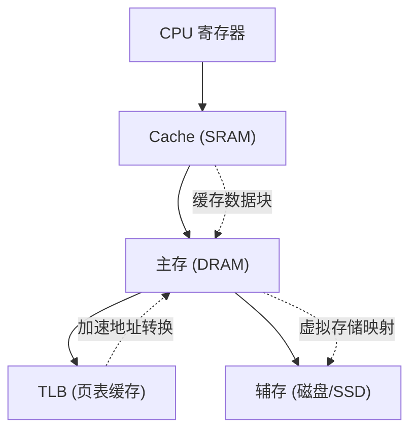

# 存储系统

## 核心定义

存储系统 研究 **层次化存储** 、 **地址映射** 、 **访问局部性** 与 **性能折中** 。常见层次包括 Cache 、主存 、辅存 、TLB 、页表 。存储系统的目标不是让所有存储都一样快，而是通过层次结构让 **平均访问代价** 尽量低。

Cache 依赖 时间局部性 （近期访问的数据很快再被访问）和 空间局部性 （访问某地址后附近地址也将被访问）；虚拟存储依赖 **程序访问的集中性** 。地址映射 题通常围绕 **主存地址如何转换为物理地址** 展开。

$$\text{平均访问时间} = \text{命中时间} + \text{失效率} \times \text{失效代价}$$

Cache 映射方式：直接映射 （每块只有 **一个固定位置** ）、全相联映射 （每块可放在 **任意位置** ）、组相联映射 （组间直接、组内全相联，$n$ 路组相联每组有 **$n$ 个候选位置** ）。替换算法：LRU （最近最少使用）、FIFO （先进先出）、随机替换 。写策略：写直达 （同时写 Cache 和主存）与 写回 （仅写 Cache，替换时写回主存）。

## 关键细节 / 操作步骤

1. 第一步：先判断题目讨论的是 **Cache** 、 **虚拟存储** 还是 **辅存组织** 。
2. 第二步：若问 Cache，先看 **命中/缺失、块大小、映射方式、替换算法、写策略** 五要素。
3. 第三步：若问 Cache 映射，直接映射地址结构为 **标记 + 行号 + 块内偏移** ；组相联为 **标记 + 组号 + 块内偏移** 。
4. 第四步：若问替换，LRU 需要 **记录访问顺序** ；FIFO 只需 **记录装入顺序** 。
5. 第五步：若问虚存，先看 **页表、TLB、缺页中断** 。虚拟地址结构为 **虚页号 + 页内偏移** 。
6. 第六步：若问 TLB，它是 **页表项的 Cache** ，加速虚拟地址到物理地址的转换。
7. 第七步：若问磁盘/辅存，先看 **盘面、磁道、扇区、柱面** 。磁盘访问时间 = **寻道时间 + 旋转等待时间 + 传输时间** 。
8. 第八步：若问性能，平均访问时间不只看 **命中率** ，还要看 **失效后的补救代价** 。
9. 第九步：若问块大小影响，块越大 **空间局部性越好** ，但失效代价和替换开销也会上升。
10. 第十步：若问层次存在的理由，回到 **容量、速度、成本** 三角矛盾。

> **⚠️ 易错辨析**
>
> - Cache 和 TLB 都像"快表"，但 Cache 缓存的是 **数据块** ，TLB 缓存的是 **页表项** ，作用对象完全不同，不能混为一谈。
> - Cache 命中率高不代表系统一定快：还要看 **命中开销、块传输开销和失效代价** 。反例：大块提高命中率但每次失效传输更多数据。
> - 虚拟存储不是"主存无限大"：它只是用 **映射与置换** 把有限主存看起来像更大的逻辑空间。
> - 局部性不是偶然现象，而是 **程序访问行为的普遍规律** ，不会用局部性分析题目往往会在命中率题上失分。反例：随机访问模式下 Cache 几乎无收益。

> **💡 技巧与口诀**
> 口诀：**Cache 看块与映射，虚存看页与快表，辅存看盘与块；直接映射一固定，全相连随意放，组相联折中选** 。
> 应用场景：看到"连续访问""循环访问""数组遍历"就先想 Cache 的 **空间局部性收益** 。若题目问"为什么要分层"，答案是 **成本、容量、速度三者不能同时极致** 。若问命中与缺失的后果，要同时写出 **是否直接返回** 与 **是否访问下一级** 。

> **📝 真题闭环**
> 题目：某 Cache 采用 4 路组相联，主存地址 32 位，Cache 数据区大小为 64KB，块大小为 64 字节。求组号位数、标记位数，并计算该 Cache 的总容量（含有效位和 LRU 位）。
>
> **解题思路**：
>
> 1. 块大小 64B → 块内偏移位数 = **$\log_2 64 = 6$** 位。
> 2. Cache 数据区 64KB，块大小 64B → Cache 共 **$64\text{KB}/64\text{B} = 1024$** 行。
> 3. 4 路组相联 → 组数 = **$1024/4 = 256$** 组 → 组号位数 = **$\log_2 256 = 8$** 位。
> 4. 标记位数 = **$32 - 8 - 6 = 18$** 位。
> 5. 每行额外开销：有效位 1 位 + 标记 18 位 + LRU 位（4 路需 **$\lceil\log_2 4\rceil = 2$** 位）= **$1+18+2 = 21$** 位。
> 6. 总容量 = 行数 ×（数据 + 开销）= **$1024 \times (64 \times 8 + 21)$** 位 = **$1024 \times 533$** = **545792 位 = 68224 字节** 。
>
> 答案：组号 **8** 位，标记 **18** 位，总容量 **68224B** 。
