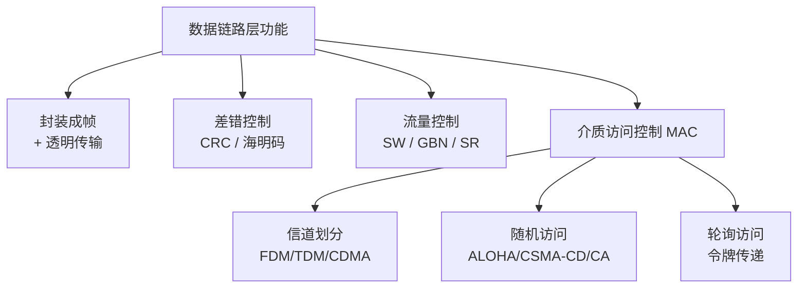

# 数据链路层

## 核心定义

**数据链路层** 在物理层提供的比特流服务之上，向网络层提供**相邻节点间**的可靠数据传输。核心三功能：**封装成帧、透明传输、差错控制**（点对点链路还负责**流量控制**）。

链路层处理的两种信道：

- **点对点信道**：一对一通信，代表协议 **PPP**。
- **广播信道**：一对多共享介质，需 **MAC 介质访问控制**，代表是以太网。

**帧 (Frame)** 是链路层的传输单元。封装成帧即在一段数据前后添加**首部和尾部**构成帧边界，链路层传输以帧为单位。

## 关键细节 / 操作步骤

1. 第一步：**封装成帧的四种方法**：
   - **字符计数法**：帧首部用一字段记录字节数（出错后影响后续所有帧，少用）。
   - **字符填充法**：用 SOH/EOT 等特殊字符作定界，数据中出现定界符则插入转义字符。
   - **比特填充法**：用 **01111110** 作定界符，发送端连续 **5 个"1"后插入一个"0"**，接收端删除（**PPP 同步传输、HDLC** 采用）。
   - **违规编码法**：用曼彻斯特编码中**不存在的电平组合**作定界（IEEE 802 采用）。
2. 第二步：**检错码——CRC 循环冗余码**（考研计算核心）：
   - 给定生成多项式 G(x)（最高次 r），在数据后**追加 r 个 0**，对 G(x) 做**模 2 除法**（异或、不借位），余数即 **CRC 冗余位**。
   - 用余数**替换**掉那 r 个 0 得到发送帧；接收端用整个帧模 2 除以 G(x)，**余数为 0 则无错**。
   - CRC 能检错但**不能纠错**，是链路层最常用的差错检测（FCS 字段即 CRC）。
3. 第三步：**纠错码——海明码**：可纠正 **1 位**错、检测 2 位错。校验位数 r 满足：

   $$
   2^r \ge m + r + 1 \quad (m = \text{数据位数})
   $$

   校验位放在 **2, 4, 8, 16…（即 2^(i-1)）** 位置。海明码距（码距）规则：**检 d 位错需码距 ≥ d+1，纠 d 位错需码距 ≥ 2d+1**。
4. 第四步：**流量控制三协议（可靠传输）**：
   - **停止-等待协议 (SW)**：发送窗口 = 接收窗口 = **1**，每发一帧等 ACK；信道利用率低。
   - **后退 N 帧 (GBN)**：接收窗口 = 1，发送窗口 $W_T \le 2^n - 1$（n 为序号位数）；出错时**从错误帧起重发其后全部**。
   - **选择重传 (SR)**：发送窗口 $W_T$ + 接收窗口 $W_R \le 2^n$，常取 $W_T = W_R = 2^{n-1}$；**只重发出错帧**。
5. 第五步：**滑动窗口关系速记**：序号空间 n bit 时——SW 收发窗口都 = 1；GBN 发 ≤ 2^n − 1、收 = 1；SR 发 + 收 ≤ 2^n。窗口上限的根因是**新旧帧序号不能混淆**，故 GBN 要留一个序号区分。
6. 第六步：**介质访问控制 (MAC)** 分三类：
   - **信道划分**（静态、无冲突）：FDM / TDM / STDM / WDM / CDMA，与物理层复用一致。
   - **随机访问**（动态、有冲突）：**ALOHA**（纯 ALOHA 想发就发；时隙 ALOHA 只在时隙边界发）、**CSMA**（发前先听）、**CSMA/CD**、**CSMA/CA**。
   - **轮询访问**（无冲突）：**令牌传递**，依次获令牌者才能发，无冲突但令牌开销大。
7. 第七步：**CSMA/CD（有线，以太网）** 四步：**先听后发、边听边听、冲突停发、随机等待重发**。冲突后用**二进制指数退避算法**：第 k 次冲突从 $\{0,1,\dots,2^k-1\}$（k ≤ 10）中随机取一个数乘以 2τ 作为等待时间，**16 次失败放弃**。
8. 第八步：**CSMA/CD vs CSMA/CA**：
   - **CD 用于有线**，能直接**检测冲突**（比较发送信号与接收信号）。
   - **CA 用于无线**，无法可靠检测冲突（隐藏终端），只能**冲突避免**——靠 **RTS/CTS 握手 + ACK** 确认。
9. 第九步：**以太网 V2 MAC 帧结构**：

   | 字段 | 长度 | 说明 |
   |---|---|---|
   | 前导码 + 帧起始定界符 | 7B + 1B | 同步与定界 |
   | 目的 MAC 地址 | 6B | 接收方硬件地址 |
   | 源 MAC 地址 | 6B | 发送方硬件地址 |
   | 类型 | 2B | 上层协议（0x0800 = IP） |
   | 数据 | 46~1500B | MTU = 1500B |
   | FCS | 4B | CRC 校验 |

   **最小帧长 64B**：保证发送端在发完前能检测到冲突，$L_{\min} = 2\tau \times \text{带宽}$（τ = 单程传播时延）。数据不足 46B 要填充。
10. 第十步：**网桥与交换机**：
    - **网桥**：根据 MAC 地址表转发，连接两个局域网，**隔离冲突域**。
    - **交换机**：多端口网桥，每个端口**一个独立冲突域**，但**仍是一个广播域**。
    - **隔离域速记**：交换机隔离冲突域、**不**隔离广播域；**路由器**才隔离广播域。

> **⚠️ 易错辨析**
>
> - **CRC 是检错码、不是纠错码**；只能判断"有错"不能定位错误位。海明码才是纠错码（纠 1 位）。
> - **GBN 发送窗口必须 ≤ 2^n − 1**（留一个序号区分新旧帧），写成 2^n 就错；SR 是 发 + 收 ≤ 2^n。
> - **CSMA/CD 用于有线（以太网），CSMA/CA 用于无线（WiFi）**，二者不能混用；CD 能"检测"冲突，CA 只能"避免"。
> - **以太网最小帧 64B 与冲突检测的 2τ 直接相关**，不是随意规定；最远两节点往返时间 2τ 内必须能发完最小帧。
> - **交换机隔离冲突域、不隔离广播域**；路由器才隔离广播域。集线器 hub 既不隔离冲突域也不隔离广播域。
> - 海明码检 d 位错需码距 **≥ d+1**，纠 d 位错需码距 **≥ 2d+1**；纠 1 位错码距 ≥ 3。
> - **PPP 同步传输用比特填充，异步传输用字符填充**，不要张冠李戴。
> - 二进制指数退避**最多重传 16 次**后丢弃该帧，且 k 上限为 **10**（截断）。

> **💡 技巧与口诀**
>
> 口诀：**GBN 留一 SR 平分（发+收≤2^n），SW 都是一；CD 有线能检测，CA 无线靠避免；交换机隔冲突域，路由器隔广播域**。
>
> 帧结构速记：**前导 8 + 目的源 MAC 各 6 + 类型 2 + 数据 46~1500 + FCS 4**；最小帧 64B。
>
> CRC 三步：①数据后补 r 个 0 → ②对生成多项式做模 2 除 → ③余数替换那 r 个 0 得发送帧。
>
> 应用场景：看到"生成多项式 + 模 2 除"想 **CRC**；看到"纠 1 位错/校验位位置"想 **海明码**；看到"窗口 + 序号位"想 **GBN/SR**；看到"有线 + 冲突检测"想 **CSMA/CD**；看到"WiFi + RTS/CTS"想 **CSMA/CA**。

> **📝 真题闭环**
> 题目：数据为 **101001**，生成多项式为 **1101**。求 CRC 冗余码及实际发送的比特串。
>
> **解题思路**：
>
> - 审题抓"**生成多项式 + 模 2 除**"，切入点是 **CRC 计算**。
> - 生成多项式 1101 最高次 r = 3，故在数据后**补 3 个 0** → 101001000。
> - 对 1101 做模 2 除（异或、不借位）：逐位处理，最终余数 = **001**。
>
> 答案：**冗余码 = 001**，实际发送的比特串 = 101001 **001**（即 **101001001**）。
>
> - 接收端校验：用 101001001 模 2 除 1101，余数为 0 → **无传输错误**。
> - 变式：若问"GBN 协议序号位 n=3 时发送窗口最大值"——答 $2^3 - 1 = 7$；SR 协议则 发 + 收 ≤ 8，常取收发各 4。
