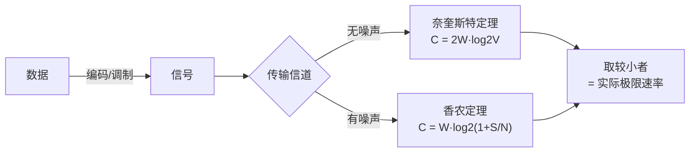

# 物理层

## 核心定义

**物理层** 是 OSI 模型的最低层，作用是在物理媒体上**透明地传输比特流**。"透明"指上层只需把比特交给物理层，不必关心信号如何在介质中传输。

物理层规范的是**通信接口的四大特性**，而非具体的传输介质：

- **机械特性**：接线器的形状、尺寸、引脚数目与排列。
- **电气特性**：电压范围、传输速率、距离限制。
- **功能特性**：某根线上出现某电压的**意义**（如表示数据或控制）。
- **过程特性（规程特性）**：不同功能的事件**出现顺序**。

数据通信基础术语：

- **码元**：一个固定时长的信号波形，代表一个**离散状态**；一个码元可携带多个比特。
- **波特率 (Baud)**：每秒传输的**码元数**（码元传输速率）。
- **比特率 (bit/s)**：每秒传输的**比特数**（信息传输速率）。
- 二者关系：**比特率 = 波特率 × log₂V**（V = 每个码元可能的离散状态数）。

## 关键细节 / 操作步骤

1. 第一步：认清题目问的是**码元速率（波特率）** 还是**信息速率（比特率）**，用 **比特率 = 波特率 × log₂V** 互推。V 是每个码元的离散状态数（如 QAM 中相位×振幅的组合数）。
2. 第二步：**奈奎斯特定理（无噪声）**——理想带宽受限、无噪声信道的最大码元速率与数据率：

   $$
   C_{\text{奈氏}} = 2W\log_2 V \quad (\text{bit/s})
   $$

   其中 W 为信道带宽（Hz），V 为每个码元的状态数；码元速率上限 = **2W Baud**。
3. 第三步：**香农定理（有噪声）**——带宽为 W、信噪比为 S/N 的有噪声信道极限容量：

   $$
   C_{\text{香农}} = W\log_2(1+S/N) \quad (\text{bit/s})
   $$

   信噪比常用分贝表示：**dB = 10 log₁₀(S/N)**，故 30 dB → S/N = 1000，20 dB → S/N = 100。
4. 第四步：**实际题目同时给带宽、信噪比、码元状态数时，取两者较小值**作为信道最大数据传输率。这是 408 最高频的物理层计算题型。
5. 第五步：**数字数据 → 数字信号编码**：
   - **NRZ（非归零码）**：高 1 低 0，**不能自带时钟**，长串 1 或 0 时难同步。
   - **曼彻斯特编码**：每个比特**中间必有跳变**，跳变方向表示 0/1，**自带时钟**，以太网采用；码元速率是比特率的 2 倍（带宽利用率 50%）。
   - **差分曼彻斯特编码**：每比特中间必跳变；**比特开始处有跳变 = 0，无跳变 = 1**；抗干扰强，令牌环网采用。
6. 第六步：**数字数据 → 模拟信号（基本带通调制）**：
   - **ASK（幅移键控）**调幅、**FSK（频移键控）**调频、**PSK（相移键控）**调相。
   - **QAM（正交振幅调制）**：振幅 + 相位组合，每个码元状态数 = 相位数 × 振幅数，可大幅提升每码元携带比特数。
7. 第七步：**模拟数据 → 数字信号（PCM 脉码调制）**三步：**采样 → 量化 → 编码**。采样遵循**奈奎斯特采样定理**：采样频率 ≥ **2 × 信号最高频率**（如话音 4 kHz → 采样率 8 kHz）。
8. 第八步：**信道复用技术**：
   - **FDM 频分复用**（模拟，频域划分）、**TDM 时分复用**（数字，时域划分）、**STDM 统计时分复用**（按需分配时隙）。
   - **WDM 波分复用**（光纤，光的频分复用）、**CDMA 码分复用**（每站分配**正交码片序列**，同时同频不干扰）。
9. 第九步：**物理层传输媒体**分两类：有导向（双绞线、同轴电缆、光纤——单模传输远/多模传输近）、无导向（无线电、微波、红外、激光）。
10. 第十步：解题顺序——看到"带宽 + 状态数"先想**奈奎斯特**；看到"带宽 + 信噪比/分贝"先想**香农**；两者都有则**分别计算取小**。注意分贝先换算回 S/N 再代入。

> **⚠️ 易错辨析**
>
> - **波特率 ≠ 比特率**：比特率 = 波特率 × log₂V。一个码元可携带多个比特，故波特率 1000 Baud、V=16 时比特率 = 4000 bit/s。
> - **奈奎斯特是无噪声上限，香农是有噪声上限**；实际信道既有带宽限制又有噪声，最终极限取**两者较小值**，不能只用其中一个。反例：仅用香农算出 40 kbit/s，但奈氏上限仅 16 kbit/s，实际只能 16 kbit/s。
> - **分贝换算易错**：信噪比 dB = **10** log₁₀(S/N)（不是 20），30 dB 对应 S/N = 1000 而非 30。
> - **两个"奈奎斯特"不要混淆**：奈奎斯特**传输定理**（码元速率 ≤ 2W）和奈奎斯特**采样定理**（采样频率 ≥ 2f_max）是两条不同的定理。
> - **曼彻斯特编码每个比特占 2 个码元**，所以带宽利用率只有 50%，并非"效率高"。
> - QAM 的码元状态数 = **相位数 × 振幅数**（如 4 相位 × 4 振幅 = 16 状态），不要只数相位。

> **💡 技巧与口诀**
>
> 口诀：**奈氏无噪 2W 码元，香农有噪 log(1+信噪比)；分贝除以十再算 S/N，两者取小是极限**。
>
> 编码速记：**曼彻斯特中间跳，差分曼看开头跳（跳为 0、不跳为 1）**。
>
> 解题三步法：①识别已知量（带宽/状态数/信噪比/分贝）→ ②选用对应定理（奈氏/香农）→ ③两者都有则取小。
>
> 应用场景：看到"无噪声 + 状态数"想 **奈奎斯特**；看到"信噪比/dB"想 **香农**；看到"采样"想 **采样定理**；看到"码分"想 **CDMA 正交码片**。

> **📝 真题闭环**
> 题目：在无噪声情况下，若某通信链路的带宽为 **3 kHz**，采用 **4 个相位、每个相位 4 种振幅** 的 QAM 调制，则该链路的最大数据传输率为多少？
>
> **解题思路**：
>
> - 审题抓"**无噪声 + QAM**"，切入点是**奈奎斯特定理**（无噪声信道）。
> - 码元状态数 V = 相位数 × 振幅数 = **4 × 4 = 16**。
> - 代入奈奎斯特公式：$C = 2W\log_2 V = 2 \times 3000 \times \log_2 16 = 6000 \times 4 = 24000$ bit/s。
>
> 答案：**24 000 bit/s（24 kbit/s）**。
>
> - 若题目改为"信噪比 30 dB 的有噪声信道"，则用香农：$C = 3000 \times \log_2(1+1000) \approx 3000 \times 9.97 \approx 29.9$ kbit/s。
> - 若同时给出"无噪 QAM 算 24 kbit/s、香农算 29.9 kbit/s"，则实际极限取小者 = **24 kbit/s**（带宽受限成了瓶颈）。
