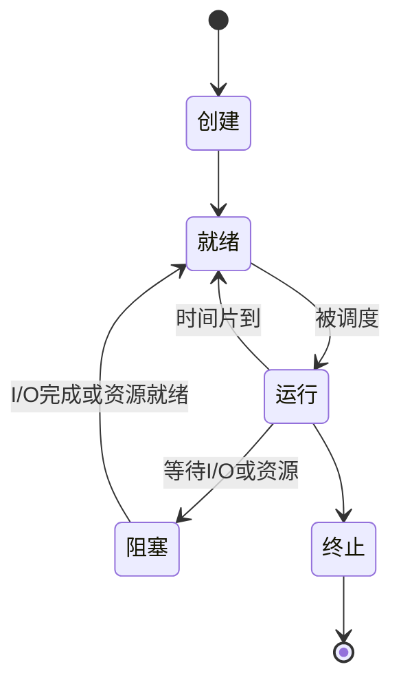

# 进程与线程

## 核心定义

进程 是程序的一次执行过程，是**资源分配的基本单位**，由 PCB 唯一标识。

线程 是进程内的执行流，是**CPU 调度的基本单位**，共享所属进程的地址空间和资源。

PCB（进程控制块）保存**进程状态、程序计数器、寄存器值、调度信息和资源清单**，是进程存在的唯一标志。

进程的五种基本状态：**就绪、运行、阻塞、创建、终止**，核心流转为 **就绪** $\to$ **运行** $\to$ **阻塞** $\to$ **就绪**。

[[进程同步与互斥]] 解决"**何时做**"，进程通信 解决"**传什么**"，两者互补不可混淆。

进程切换需要切换**地址空间、页表、内核栈、寄存器**等完整上下文；线程切换仅需保存**程序计数器、寄存器、栈指针**，开销远小于进程切换。

进程间通信（IPC）方式包括**管道、消息队列、共享存储、信号量、信号、套接字**。

线程共享进程的**地址空间、打开的文件、信号处理**，但每个线程拥有独立的**栈、程序计数器、寄存器**。

## 操作系统的目标与发展历程

**OS 三大设计目标**：

| 目标   | 含义                           |
| ---- | ---------------------------- |
| 方便性  | 提供友好接口（GUI / 命令行），用户不必直接操作硬件 |
| 有效性  | 提高 **资源利用率** 和系统 **吞吐量**     |
| 可扩充性 | 采用微内核 / 层次化结构，便于增加新功能模块      |

> **🚫 易错**：第三个目标是 **可扩充性**，不是安全性 / 可靠性 / 通用性。

**OS 发展四阶段**（记"第一次"）：

| 阶段    | 关键突破                                            | 交互    |
| ----- | ----------------------------------------------- | ----- |
| 单道批处理 | **监督程序**实现作业自动过渡（第一次自动过渡）                       | 无     |
| 多道批处理 | 多道程序并发，**首次引入"进程"概念**和内存保护（第一次解决 CPU/I/O 速度不匹配） | 无     |
| 分时系统  | 时间片轮转，**首次实现人机交互**                              | 有     |
| 实时系统  | 严格截止时间内响应                                       | 有（实时） |

> **🚫 张冠李戴**：缓解"CPU 与 I/O 速度不匹配"是 **多道** 批处理的功劳，不是单道（单道 I/O 时 CPU 仍干等）。"进程"概念起源于 **多道批处理**。批处理追求 **吞吐量**，分时追求 **响应时间**。

## 分时系统的特征

分时系统（如 Linux / Unix）四大特征：**多路性、交互性、及时性、独立性**。

| 特征  | 含义              |
| --- | --------------- |
| 多路性 | 一台主机连接多个终端      |
| 交互性 | 用户可随时与系统对话      |
| 及时性 | 响应时间短，用户感觉不到卡顿  |
| 独立性 | 每个用户感觉自己独占整台计算机 |

> **🚫 词汇陷阱**：分时系统提供 **独立性**（假象），不是 **独占性**（物理现实）。物理 CPU 只有一个，大家轮流切片使用——"独占性"不是分时系统的特征。

## 用户态与内核态、特权指令

CPU 两种工作模式：**用户态**（只能执行非特权指令）和 **内核态**（可执行任何指令）。

**特权指令**（只能在内核态执行）：改变系统物理状态、影响其他进程或分配硬件资源的操作——**关中断、设置时钟日期、I/O 指令、修改页表、进程切换**。

**非特权指令**（用户态可执行）：在进程自己沙盒里"管自己"的操作——加减乘除、清零通用寄存器、逻辑取反（NOT）。

**状态切换路径**：

| 触发        | 方向        | 例子                                   |
| --------- | --------- | ------------------------------------ |
| 访管指令 trap | 用户态 → 内核态 | 系统调用（read / fork），trap 本身在 **用户态执行** |
| 异常（内中断）   | 用户态 → 内核态 | 缺页、除零，硬件强制拦截                         |
| 纯用户态操作    | 不切换       | NOT R0、通用寄存器清零、MOV R1,R2             |

> **🚫 权限直觉陷阱**：trap 是"**引发**切换的指令"，但它本身在 **用户态执行**——别当成"必须在内核态执行的指令"。口诀：**"管别人/管硬件/管全局"→特权指令；"管自己/算算数"→非特权指令**。系统调用、缺页、执行 Trap 都是用户态行为，只是通往内核态的"车票"。详见 [[系统调用]]。

## 关键细节 / 操作步骤

1. 区分 进程状态（就绪/运行/阻塞）与 线程调度 的关系，线程是调度的实际对象。
2. 比较**进程切换**和**线程切换**代价：进程需切换地址空间和页表（**刷新 TLB**），线程仅切换少量寄存器。
3. 资源归属：进程拥有**独立地址空间和系统资源**，线程共享进程资源。
4. 同步机制：**互斥量、信号量、条件变量**用于保护共享数据的互斥访问。
5. 通信区分：同进程内线程通过**共享内存**直接通信；进程间需通过**IPC 机制**（管道/消息队列/共享存储/套接字）。
6. 多线程共享数据易引发 竞态条件，必须加同步保护。
7. 多核环境下线程更常见，因为线程更易于**在多个核心上并行分摊执行**。
8. 调度单位：现代 OS 中线程通常是 CPU 调度的基本对象，进程是资源分配的基本对象。具体的调度策略（FCFS/SJF/RR 等）见 [[CPU 调度算法]]。

> **⚠️ 易错辨析**
> 
> 
> 
> 进程不等于程序：程序是静态代码，进程是动态执行过程。
> 
> 线程不等于独立资源容器：线程没有独立地址空间，它依附于进程。
> 
> "线程切换无开销"是错误的：线程切换仍需保存/恢复寄存器和栈指针，只是比进程轻。
> 
> 同步不是通信：同步解决"何时传、何时做"（**时序协调**），通信解决"传什么"（**数据传递**）。若题目问"同步和通信的区别"，必须分别从时序和数据两个角度回答。
> 
> 比较进程与线程时，最稳妥的框架是**资源、调度、切换、通信**四个维度。

> **💡 技巧与口诀**
> 
> 
> 
> 口诀：**进程管资源，线程管执行；PCB 记状态，调度看现场**。
> 
> 应用场景：看到"多任务、并发、共享数据、切换代价"，先分清进程和线程的职责。
> 
> 若题目问"为什么线程轻量"，优先从**共享资源**和**切换开销小**两个角度答。
> 
> 若题目问"进程适合什么场景"，答资源隔离（**独立地址空间，隔离性强**）。
> 
> 若题目问"线程适合什么场景"，答高并发（**创建和切换开销小**）。

> **📝 真题闭环**
> 
> 题目：某系统采用多线程模型，线程 T1 和 T2 属于同一进程 P，试回答：(1) T1 和 T2 共享哪些资源？(2) 各自独有哪些资源？(3) 若 T1 发生缺页中断，T2 会受影响吗？为什么？
> 
> **解题思路**：
> 
> 答案：(1) **地址空间、打开文件、信号处理、全局变量**；(2) **栈、程序计数器、寄存器、线程 ID**；(3) **会受影响，因为共享地址空间，缺页中断阻塞整个进程**。
> 
> 
> 
> 
> 
> 审题抓"同一进程内的线程关系"，切入点是**线程共享与独有资源划分**。
> 
> 第(1)问：共享**地址空间、打开文件、信号处理、全局变量**。
> 
> 第(2)问：各自独有**栈、程序计数器、寄存器、线程 ID**。
> 
> 第(3)问：**会受影响**，因为同进程线程共享地址空间，缺页会导致整个进程被阻塞，进程中所有线程都无法继续执行。
