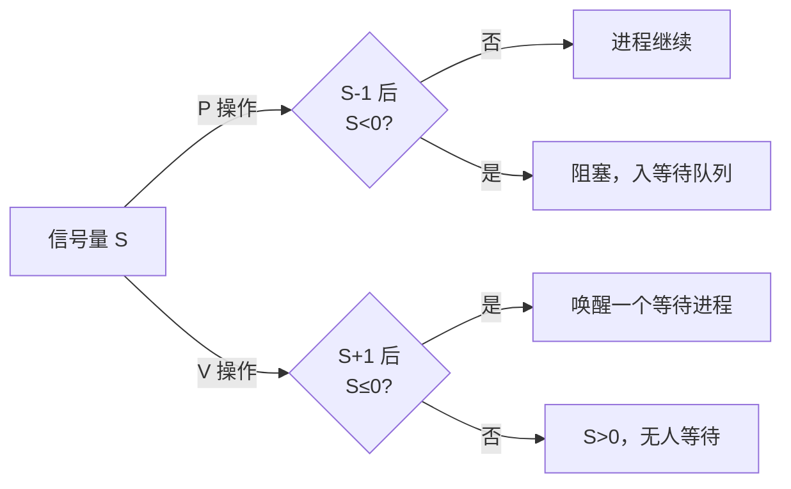

# 进程同步与互斥

## 核心定义

**临界资源** 是一次仅允许一个进程使用的共享资源（如打印机、共享变量、缓冲区）；进程中**访问临界资源的那段代码**称为 **临界区**。

**同步** 是多个进程因**直接制约**（前后序依赖）而必须按一定顺序执行的协调关系，解决"**何时做**"；**互斥** 是多个进程因**间接制约**（争用同一临界资源）而必须排他访问的协调关系，解决"**谁能做**"。两者都靠 **信号量** 实现。

**信号量** 是一种特殊的整型变量 S，配两个**原语操作**：

$$
P(S):\ S = S-1;\ \text{若}\ S<0,\ \text{阻塞本进程}\\
V(S):\ S = S+1;\ \text{若}\ S\le 0,\ \text{唤醒一个等待进程}
$$

P、V 来源于荷兰语 **Proberen（测试）/ Verhogen（增加）**，二者均为**不可中断的原语**。



考研常考 **整型信号量与记录型信号量的区别、PV 操作语义、生产者-消费者、读者-写者、哲学家进餐、前驱关系、管程**。

## 关键细节 / 操作步骤

1. 第一步：先区分题目问的是 **同步** 还是 **互斥**。互斥信号量初值恒为 **1**，保护临界资源；同步信号量初值 **等于初始可用资源数**。
2. 第二步：写 PV 代码前，先列出所有进程及其**关系**——谁等谁的产品（同步），谁抢同一资源（互斥）。
3. 第三步：**生产者-消费者问题**（单一缓冲区大小 N）标准解法：

   ```c
   semaphore mutex = 1;   // 互斥访问缓冲区
   semaphore empty  = N;  // 空缓冲区数（同步）
   semaphore full   = 0;  // 满缓冲区数（同步）

   producer() {            // 生产者
       生产一个产品;
       P(empty);           // 申请空位（必须在 P(mutex) 之前）
       P(mutex);
       把产品放入缓冲区;
       V(mutex);
       V(full);            // 通知有满位
   }

   consumer() {            // 消费者
       P(full);            // 申请满位（必须在 P(mutex) 之前）
       P(mutex);
       从缓冲区取出产品;
       V(mutex);
       V(empty);           // 通知有空位
       消费产品;
   }
   ```

4. 第四步：**P 操作顺序决定是否会死锁**。必须**先做同步 P（empty/full），再做互斥 P（mutex）**；若颠倒成 `P(mutex); P(empty)`，缓冲区满时生产者拿住 mutex 又等不到 empty，消费者拿不到 mutex，**双方死锁**。V 操作顺序一般不影响正确性。
5. 第五步：**读者-写者问题**（读优先版本）：

   ```c
   semaphore rw    = 1;   // 互斥访问共享文件（写者间、首尾读者与写者间）
   semaphore mutex = 1;   // 互斥访问 readcount
   int readcount    = 0;  // 当前正在读的读者数

   writer() {
       P(rw);
       写文件;
       V(rw);
   }

   reader() {
       P(mutex);
       readcount++;
       if (readcount == 1) P(rw);   // 第一个读者要"锁写"
       V(mutex);
       读文件;
       P(mutex);
       readcount--;
       if (readcount == 0) V(rw);   // 最后一个读者"解锁写"
       V(mutex);
   }
   ```

6. 第六步：**哲学家进餐问题**（5 人围圆桌，每两人间 1 根筷子，需同时拿左右两根才能吃）。朴素解法 `P(fork[i]); P(fork[(i+1)%5])` 在 5 人同时拿左筷子时会 **死锁**。防死锁方案：①限制**至多 4 人**同时拿筷子；②**奇数号先拿左、偶数号先拿右**；③仅当**左右两根都能拿到**时才拿。
7. 第七步：**前驱关系（同步关系图）**。每个箭头 $S_i \to S_j$ 对应一个初值为 **0** 的信号量，在 $S_i$ 末尾 V，在 $S_j$ 开头 P，即可实现先后顺序约束。
8. 第八步：**管程（Monitor）** 是高级同步机制，由**共享数据结构 + 操作过程 + 初始化代码**组成。特点：管程内变量只能被管程内过程访问；**每次只允许一个进程进入管程**（互斥由编译器/语言运行时自动保证，无需程序员写 P/V）；通过 **条件变量 + wait/signal** 解决同步。
9. 第九步：临界区管理的**四条准则**：**空闲让进、忙则等待、有限等待、让权等待**。其中 **"让权等待"**（不能进入临界区时应放弃 CPU）只有**记录型信号量**满足，整型信号量违背此原则（忙等）。
10. 第十步：信号量初值速判——**互斥信号量 = 1**；**同步信号量 = 初始资源数**（生产者-消费者中 empty 初值 = 缓冲区容量 N，full 初值 = 0）；**前驱信号量 = 0**。

> **⚠️ 易错辨析**
>
> - **P(empty) 和 P(mutex) 顺序绝不能反**：先同步后互斥，否则满缓冲时死锁；这是考研最高频考点。
> - "同步信号量初值是 1"是错的：互斥信号量初值才是 1，同步信号量初值取决于初始资源数量。反例：empty 初值 = N 而非 1。
> - 整型信号量**不满足"让权等待"**（会忙等，占用 CPU），只有**记录型信号量**满足；二者都满足"互斥"，但只有记录型让进程阻塞而非忙等。
> - "读者-写者读优先版本"中写者可能**被饿死**（只要有读者不断来，readcount 永不为 0，rw 永不释放）；写优先版本则相反。
> - 哲学家进餐朴素解法会死锁，**必须主动加防死锁约束**，不能照搬。
> - V 操作唤醒的是"**一个**"等待进程，且具体哪个取决于队列策略（通常 FIFO）；"唤醒所有"是**管程的 signal/broadcast**，不是信号量 V。
> - 管程的互斥**由编译器自动保证**，程序员只写同步逻辑，不需要手写 P/V；这是它和信号量的根本差异。

> **💡 技巧与口诀**
>
> 口诀：**互斥初值一，同步初值看资源，前驱初值零；P 先同步后互斥，V 的顺序不要紧**。
>
> 解题五步法：①画进程关系（谁产生/消费什么）→ ②定义信号量（互斥=1、同步=资源数）→ ③每个进程写完整 P/V → ④检查 P 顺序（防死锁）→ ⑤检查是否有"先 V 后 P"的成对关系。
>
> 应用场景：题目一旦出现"缓冲区""共享变量""多个进程协作""前驱图/先后顺序"，立刻想到**信号量 + PV**；看到"一次只能一个进程访问"想**互斥 mutex=1**；看到"前者完成后后者才能开始"想**同步信号量=0**。

> **📝 真题闭环**
> 题目：桌上有一只盘子，最多可放 **N** 个水果。父亲专向盘中放苹果，母亲专向盘中放橘子；儿子专等吃苹果，女儿专等吃橘子。盘子是临界资源，每次只能由一人操作。试用信号量与 P/V 操作给出四个进程的同步互斥算法。
>
> **解题思路**：
>
> - 审题抓"**多生产者多消费者 + 临界资源**"，既有同步（父母产、子女消费）又有互斥（盘子一次一人操作）。
> - 信号量定义：`plate` 同步空位（初值 **N**）；`apple` 同步苹果（初值 **0**）；`orange` 同步橘子（初值 **0**）；`mutex` 互斥访问盘子（初值 **1**）。
> - 关键检查：P 操作均"**先同步后互斥**"，不会死锁；放与取成对 P/V。
>
> 答案：
>
> ```c
> semaphore plate  = N;  // 盘子剩余空位
> semaphore apple  = 0;  // 盘中苹果数
> semaphore orange = 0;  // 盘中橘子数
> semaphore mutex  = 1;  // 互斥访问盘子
>
> father()   { P(plate);  P(mutex); 放苹果; V(mutex); V(apple);  }
> mother()   { P(plate);  P(mutex); 放橘子; V(mutex); V(orange); }
> son()      { P(apple);  P(mutex); 取苹果; V(mutex); V(plate);  }
> daughter() { P(orange); P(mutex); 取橘子; V(mutex); V(plate);  }
> ```
>
> - `plate` 保证盘中水果不超过 N；`apple`/`orange` 保证只有对应水果存在时相应子女才取；`mutex` 保证放/取互斥。四个 P 操作全部先同步后互斥，**无死锁**。
