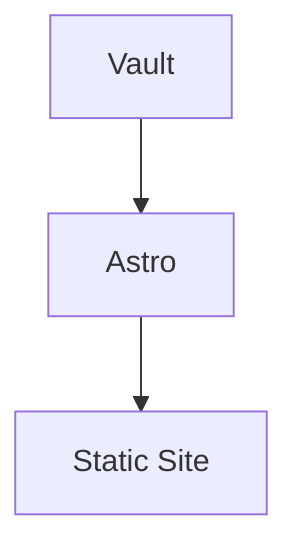

# Markdown Rendering Pipeline Implementation Plan

> **For agentic workers:** REQUIRED SUB-SKILL: Use superpowers:subagent-driven-development (recommended) or superpowers:executing-plans to implement this plan task-by-task. Steps use checkbox (`- [ ]`) syntax for tracking.

**Goal:** Add GitHub-style Markdown rendering capabilities to `site/`: Shiki code highlighting, KaTeX math, Mermaid diagrams, WikiLinks, GitHub Alerts, and duplicate Markdown H1 hiding.

**Architecture:** Use Astro 7's `markdown.processor` with `@astrojs/markdown-remark` for build-time remark/rehype transforms. Use a small Astro component for client-side Mermaid rendering because diagrams require browser SVG rendering. Keep visual styling aligned with the existing Instrument Panel UI: hairline borders, GitHub-light colors, no cards, no decorative wrappers.

**Tech Stack:** Astro 7, `@astrojs/markdown-remark`, remark/rehype, Shiki via Astro, KaTeX, Mermaid, UnoCSS Typography, custom remark plugins.

---

## Current Project Facts

The current site app is:

```txt
11408-vault/site
```

Important current files:

```txt
site/astro.config.mjs
site/uno.config.ts
site/src/layouts/Layout.astro
site/src/pages/notes/[...slug].astro
site/src/content.config.ts
site/src/lib/vault-notes.ts
```

The note detail route is:

```txt
site/src/pages/notes/[...slug].astro
```

Do not use the older path:

```txt
site/src/pages/notes/[slug].astro
```

Current `astro.config.mjs` still has:

```js
markdown: {
  syntaxHighlight: false,
}
```

This plan replaces that with Astro 7's modern Markdown processor.

## Non-Negotiable Rules

- Do not use CDN for KaTeX CSS.
- Do not use deprecated `markdown.remarkPlugins` / `markdown.rehypePlugins`.
- Use `markdown.processor: unified(...)` from `@astrojs/markdown-remark`.
- Do not add `expressive-code` in this phase.
- Do not add Prism.
- Do not create style-only components.
- Do not turn Mermaid, Alerts, or blockquotes into decorative cards.
- Do not globally load Mermaid on pages that do not need it.
- Do not overwrite unrelated UI/IA work from the other plans.
- Preserve `presetWind3()` in `uno.config.ts`.

## Dependencies

Install from `site/`:

```powershell
pnpm add @astrojs/markdown-remark remark-math rehype-katex katex mermaid github-slugger unist-util-visit
```

Why:

- `@astrojs/markdown-remark`: keeps remark/rehype support in Astro 7's `markdown.processor`.
- `remark-math` and `rehype-katex`: build-time math transform.
- `katex`: local CSS and rendering assets.
- `mermaid`: client-side diagram renderer.
- `github-slugger`: stable slug normalization for WikiLink matching if needed.
- `unist-util-visit`: compact custom remark plugin traversal.

---

### Task 1: Baseline Verification

**Files:**
- Read: `site/package.json`
- Read: `site/astro.config.mjs`
- Read: `site/src/pages/notes/[...slug].astro`
- Read: `site/src/layouts/Layout.astro`

- [ ] **Step 1: Check working tree**

Run from `11408-vault/`:

```powershell
git status --short
```

Expected: unrelated user changes may exist. Do not revert them.

- [ ] **Step 2: Confirm note route path**

Run from `11408-vault/`:

```powershell
rg --files .\site\src\pages\notes
```

Expected output includes:

```txt
site\src\pages\notes\[...slug].astro
site\src\pages\notes\index.astro
```

- [ ] **Step 3: Run baseline check**

Run from `11408-vault/site`:

```powershell
pnpm check
```

Expected: no Astro type errors.

- [ ] **Step 4: Run baseline build**

Run from `11408-vault/site`:

```powershell
pnpm build
```

Expected: build completes.

---

### Task 2: Install Markdown Pipeline Dependencies

**Files:**
- Modify: `site/package.json`
- Modify: `site/pnpm-lock.yaml`

- [ ] **Step 1: Install dependencies**

Run from `11408-vault/site`:

```powershell
pnpm add @astrojs/markdown-remark remark-math rehype-katex katex mermaid github-slugger unist-util-visit
```

- [ ] **Step 2: Verify dependency list**

Run from `11408-vault/site`:

```powershell
pnpm list @astrojs/markdown-remark remark-math rehype-katex katex mermaid github-slugger unist-util-visit --depth 0
```

Expected: each package appears once.

---

### Task 3: Create WikiLink Index Helper

**Files:**
- Create: `site/src/lib/markdown/wiki-index.mjs`

- [ ] **Step 1: Create markdown helper directory**

Run from `11408-vault/`:

```powershell
New-Item -ItemType Directory -Force -Path '.\site\src\lib\markdown'
```

- [ ] **Step 2: Create `wiki-index.mjs`**

Create `site/src/lib/markdown/wiki-index.mjs`:

```js
import { readdir, readFile } from 'node:fs/promises';
import { join, relative, resolve, sep } from 'node:path';

const DOCS_DIR = resolve(process.cwd(), '../docs');

let cachedIndex;

export async function getWikiIndex() {
  if (cachedIndex) return cachedIndex;

  const files = await readMarkdownFiles(DOCS_DIR);
  const entries = await Promise.all(files.map(readEntry));
  const byKey = new Map();

  for (const entry of entries) {
    addKey(byKey, entry.title, entry.href);
    addKey(byKey, entry.stem, entry.href);
    addKey(byKey, normalizeKey(entry.title), entry.href);
    addKey(byKey, normalizeKey(entry.stem), entry.href);
  }

  cachedIndex = byKey;
  return cachedIndex;
}

async function readMarkdownFiles(dir) {
  const entries = await readdir(dir, { withFileTypes: true });
  const files = [];

  for (const entry of entries) {
    const fullPath = join(dir, entry.name);

    if (entry.isDirectory()) {
      files.push(...await readMarkdownFiles(fullPath));
      continue;
    }

    if (entry.isFile() && entry.name.endsWith('.md')) {
      files.push(fullPath);
    }
  }

  return files;
}

async function readEntry(file) {
  const source = await readFile(file, 'utf8');
  const title = readFrontmatterTitle(source);
  const id = relative(DOCS_DIR, file).split(sep).join('/').replace(/\.md$/, '');
  const stem = id.split('/').at(-1) || id;

  return {
    title: title || stem,
    stem,
    href: `/notes/${id}/`,
  };
}

function readFrontmatterTitle(source) {
  const match = source.match(/^---\r?\n([\s\S]*?)\r?\n---/);
  if (!match) return '';

  const title = match[1].match(/^title:\s*["']?(.+?)["']?\s*$/m);
  return title?.[1]?.trim() || '';
}

function addKey(map, key, href) {
  const value = key?.trim();
  if (!value || map.has(value)) return;
  map.set(value, href);
}

export function normalizeKey(value) {
  return value.trim().toLowerCase();
}
```

- [ ] **Step 3: Run check**

Run from `11408-vault/site`:

```powershell
pnpm check
```

Expected: no errors.

---

### Task 4: Create WikiLink Remark Plugin

**Files:**
- Create: `site/src/lib/markdown/remark-wikilinks.mjs`

- [ ] **Step 1: Create `remark-wikilinks.mjs`**

Create `site/src/lib/markdown/remark-wikilinks.mjs`:

```js
import { visit } from 'unist-util-visit';
import { getWikiIndex, normalizeKey } from './wiki-index.mjs';

const WIKILINK_RE = /!?\[\[([^\]|]+)(?:\|([^\]]+))?\]\]/g;

export default function remarkWikilinks() {
  return async function transformer(tree) {
    const index = await getWikiIndex();

    visit(tree, 'text', (node, indexInParent, parent) => {
      if (!parent || typeof indexInParent !== 'number') return;
      if (!node.value.includes('[[')) return;

      const children = splitWikilinks(node.value, index);
      if (children.length === 1 && children[0].type === 'text') return;

      parent.children.splice(indexInParent, 1, ...children);
    });
  };
}

function splitWikilinks(value, index) {
  const nodes = [];
  let lastIndex = 0;

  for (const match of value.matchAll(WIKILINK_RE)) {
    const [raw, target, alias] = match;
    const start = match.index ?? 0;

    if (start > lastIndex) {
      nodes.push({ type: 'text', value: value.slice(lastIndex, start) });
    }

    if (raw.startsWith('!')) {
      nodes.push({ type: 'text', value: raw });
    } else {
      nodes.push(createWikiNode(target.trim(), alias?.trim(), index));
    }

    lastIndex = start + raw.length;
  }

  if (lastIndex < value.length) {
    nodes.push({ type: 'text', value: value.slice(lastIndex) });
  }

  return nodes;
}

function createWikiNode(target, alias, index) {
  const href = index.get(target) || index.get(normalizeKey(target));
  const label = alias || target;

  if (href) {
    return {
      type: 'link',
      url: href,
      title: null,
      data: {
        hProperties: {
          className: ['internal-link'],
        },
      },
      children: [{ type: 'text', value: label }],
    };
  }

  return {
    type: 'html',
    value: `<span class="wiki-link-missing">[[${escapeHtml(label)}]]</span>`,
  };
}

function escapeHtml(value) {
  return value
    .replaceAll('&', '&amp;')
    .replaceAll('<', '&lt;')
    .replaceAll('>', '&gt;')
    .replaceAll('"', '&quot;');
}
```

- [ ] **Step 2: Supported syntax**

This plugin supports:

```md
[[进程与线程]]
[[进程与线程|进程模型]]
```

It intentionally leaves embeds unchanged:

```md
![[image.png]]
![[other-note]]
```

- [ ] **Step 3: Run check**

Run from `11408-vault/site`:

```powershell
pnpm check
```

Expected: no errors.

---

### Task 5: Create GitHub Alerts Remark Plugin

**Files:**
- Create: `site/src/lib/markdown/remark-github-alerts.mjs`

- [ ] **Step 1: Create `remark-github-alerts.mjs`**

Create `site/src/lib/markdown/remark-github-alerts.mjs`:

```js
import { visit } from 'unist-util-visit';

const ALERTS = new Map([
  ['NOTE', 'Note'],
  ['TIP', 'Tip'],
  ['IMPORTANT', 'Important'],
  ['WARNING', 'Warning'],
  ['CAUTION', 'Caution'],
]);

export default function remarkGithubAlerts() {
  return function transformer(tree) {
    visit(tree, 'blockquote', (node) => {
      const marker = getAlertMarker(node);
      if (!marker) return;

      const title = ALERTS.get(marker);
      const className = `markdown-alert markdown-alert-${marker.toLowerCase()}`;

      removeAlertMarker(node);

      node.data ||= {};
      node.data.hProperties = {
        ...(node.data.hProperties || {}),
        className,
        dataAlert: marker,
      };

      node.children.unshift({
        type: 'paragraph',
        data: {
          hProperties: {
            className: 'markdown-alert-title',
          },
        },
        children: [{ type: 'text', value: title }],
      });
    });
  };
}

function getAlertMarker(node) {
  const first = node.children[0];
  if (!first || first.type !== 'paragraph') return '';

  const firstChild = first.children?.[0];
  if (!firstChild || firstChild.type !== 'text') return '';

  const match = firstChild.value.match(/^\[!(NOTE|TIP|IMPORTANT|WARNING|CAUTION)\]\s*/);
  return match?.[1] || '';
}

function removeAlertMarker(node) {
  const first = node.children[0];
  const firstChild = first?.children?.[0];
  if (!first || !firstChild || firstChild.type !== 'text') return;

  firstChild.value = firstChild.value.replace(/^\[!(NOTE|TIP|IMPORTANT|WARNING|CAUTION)\]\s*/, '');

  if (first.children.length === 1 && firstChild.value.length === 0) {
    node.children.shift();
  }
}
```

- [ ] **Step 2: Supported syntax**

This plugin supports:

```md
> [!NOTE]
> Useful information.

> [!TIP]
> Helpful advice.

> [!IMPORTANT]
> Key information.

> [!WARNING]
> Risky information.

> [!CAUTION]
> Negative outcome warning.
```

- [ ] **Step 3: Run check**

Run from `11408-vault/site`:

```powershell
pnpm check
```

Expected: no errors.

---

### Task 6: Configure Astro Markdown Processor

**Files:**
- Modify: `site/astro.config.mjs`

- [ ] **Step 1: Replace Markdown config**

Modify `site/astro.config.mjs` to merge in these imports:

```js
import { unified } from '@astrojs/markdown-remark';
import remarkMath from 'remark-math';
import rehypeKatex from 'rehype-katex';
import remarkGithubAlerts from './src/lib/markdown/remark-github-alerts.mjs';
import remarkWikilinks from './src/lib/markdown/remark-wikilinks.mjs';
```

Replace:

```js
markdown: {
  syntaxHighlight: false,
},
```

with:

```js
markdown: {
  syntaxHighlight: 'shiki',
  shikiConfig: {
    theme: 'github-light',
    wrap: false,
  },
  processor: unified({
    remarkPlugins: [
      remarkMath,
      remarkGithubAlerts,
      remarkWikilinks,
    ],
    rehypePlugins: [
      rehypeKatex,
    ],
  }),
},
```

- [ ] **Step 2: Keep existing integrations**

Do not remove:

```js
integrations: [
  sitemap(),
  vue(),
  UnoCSS(),
],
```

- [ ] **Step 3: Run check**

Run from `11408-vault/site`:

```powershell
pnpm check
```

Expected: no errors.

---

### Task 7: Add KaTeX And Markdown Global Styles

**Files:**
- Modify: `site/src/layouts/Layout.astro`

- [ ] **Step 1: Import local KaTeX CSS**

In the frontmatter of `site/src/layouts/Layout.astro`, add:

```astro
import 'katex/dist/katex.min.css';
```

Do not use CDN `<link>` tags.

- [ ] **Step 2: Add scoped global CSS**

Inside the existing `<style is:global>` block, add:

```css
  .katex-display {
    overflow-x: auto;
    overflow-y: hidden;
    padding: 0.25rem 0;
  }

  .katex {
    font-size: 1em;
  }

  .prose-blog .internal-link {
    color: #0969da;
    text-decoration: none;
    text-underline-offset: 3px;
  }

  .prose-blog .internal-link:hover {
    text-decoration: underline;
  }

  .prose-blog .wiki-link-missing {
    color: #8c959f;
    border-bottom: 1px dashed #d0d7de;
  }

  .prose-blog .markdown-alert {
    margin: 1.5rem 0;
    padding: 0.75rem 1rem;
    border-left: 0.25rem solid #d0d7de;
    color: #24292f;
  }

  .prose-blog .markdown-alert-title {
    display: flex;
    align-items: center;
    gap: 0.375rem;
    margin: 0 0 0.5rem;
    font-family: ui-monospace, SFMono-Regular, "SF Mono", Menlo, Consolas, "Liberation Mono", monospace;
    font-size: 13px;
    font-weight: 600;
    line-height: 1.5;
  }

  .prose-blog .markdown-alert > :last-child {
    margin-bottom: 0;
  }

  .prose-blog .markdown-alert-note {
    border-left-color: #0969da;
  }

  .prose-blog .markdown-alert-tip {
    border-left-color: #1a7f37;
  }

  .prose-blog .markdown-alert-important {
    border-left-color: #8250df;
  }

  .prose-blog .markdown-alert-warning {
    border-left-color: #9a6700;
  }

  .prose-blog .markdown-alert-caution {
    border-left-color: #cf222e;
  }

  .prose-blog .mermaid {
    margin: 1.5rem 0;
    overflow-x: auto;
    padding: 1rem;
    border: 1px solid #d0d7de;
    border-radius: 6px;
    background: #f6f8fa;
  }

  .hide-markdown-title > h1:first-child {
    display: none;
  }
```

If the typography-blockquote plan has already added `.prose-blog code::before`, `.prose-blog blockquote p:first-of-type::before`, or `.prose-blog pre code`, keep those overrides and do not duplicate them.

- [ ] **Step 3: Run check**

Run from `11408-vault/site`:

```powershell
pnpm check
```

Expected: no errors.

---

### Task 8: Add Mermaid Loader Component

**Files:**
- Create: `site/src/components/MermaidLoader.astro`

- [ ] **Step 1: Create `MermaidLoader.astro`**

Create `site/src/components/MermaidLoader.astro`:

```astro
<script>
  const MERMAID_SELECTOR = 'pre > code.language-mermaid';

  async function renderMermaid() {
    const blocks = [...document.querySelectorAll(MERMAID_SELECTOR)].filter(
      (block) => !block.dataset.mermaidProcessed,
    );

    if (blocks.length === 0) return;

    const { default: mermaid } = await import('mermaid');

    mermaid.initialize({
      startOnLoad: false,
      securityLevel: 'strict',
      theme: 'base',
      themeVariables: {
        primaryColor: '#f6f8fa',
        primaryTextColor: '#24292f',
        primaryBorderColor: '#d0d7de',
        lineColor: '#8c959f',
        secondaryColor: '#ffffff',
        tertiaryColor: '#f6f8fa',
        fontFamily:
          'system-ui, -apple-system, BlinkMacSystemFont, "Segoe UI", sans-serif',
      },
    });

    for (const [index, block] of blocks.entries()) {
      block.dataset.mermaidProcessed = 'true';

      const source = block.textContent || '';
      const pre = block.parentElement;
      if (!pre) continue;

      const wrapper = document.createElement('div');
      wrapper.className = 'mermaid';
      wrapper.setAttribute('data-mermaid-processed', 'true');

      try {
        const id = `mermaid-${Date.now()}-${index}`;
        const { svg } = await mermaid.render(id, source);
        wrapper.innerHTML = svg;
        pre.replaceWith(wrapper);
      } catch (error) {
        console.warn('Mermaid render failed', error);
      }
    }
  }

  document.addEventListener('astro:page-load', renderMermaid);
  renderMermaid();
</script>
```

- [ ] **Step 2: Verify behavior**

The component must:

- dynamically import Mermaid only when Mermaid blocks exist
- use `astro:page-load` for ClientRouter compatibility
- keep original code block if rendering fails
- avoid rendering the same block twice

---

### Task 9: Attach Mermaid And Hide Duplicate Markdown H1

**Files:**
- Modify: `site/src/pages/notes/[...slug].astro`

- [ ] **Step 1: Import MermaidLoader**

Add:

```astro
import MermaidLoader from '../../components/MermaidLoader.astro';
```

- [ ] **Step 2: Update prose wrapper**

Find:

```astro
<div class="prose-blog mt-8">
  <Content />
</div>
```

Replace with:

```astro
<div class="prose-blog hide-markdown-title mt-8">
  <Content />
</div>
<MermaidLoader />
```

This hides only the first Markdown H1 inside the rendered Markdown body. The Astro template title remains the canonical page title.

- [ ] **Step 3: Run check**

Run from `11408-vault/site`:

```powershell
pnpm check
```

Expected: no errors.

---

### Task 10: Optional Verification Fixture

**Files:**
- Optional Create: `site/src/content/notes/markdown-capabilities-demo.md`

- [ ] **Step 1: Prefer existing docs**

First search existing docs:

```powershell
rg -n "\$\$|```mermaid|\[\[|>\s*\[!(NOTE|TIP|IMPORTANT|WARNING|CAUTION)\]" ..\docs .\src\content\notes
```

If existing notes cover the needed syntax, do not create a fixture.

- [ ] **Step 2: Create fixture only when needed**

If needed, create a temporary fixture:

````md
---
title: Markdown Capabilities Demo
pubDate: 2026-07-01
---

# Markdown Capabilities Demo

Inline math $a^2 + b^2 = c^2$.

$$
\sum_{i=1}^{n} i = \frac{n(n+1)}{2}
$$

```ts
const value: number = 408
console.log(value)
```



[[Markdown Capabilities Demo]]
[[Missing Note]]

> [!NOTE]
> 这是一个普通提示，支持 [[Markdown Capabilities Demo]]。

> [!WARNING]
> 这是风险提示。
````

- [ ] **Step 3: Remove fixture before final if it should not ship**

If this file is only for verification, delete it before final build.

---

### Task 11: Build And Inspect Output

**Files:**
- Verify: `site/dist`

- [ ] **Step 1: Run final check**

Run from `11408-vault/site`:

```powershell
pnpm check
```

Expected: no errors.

- [ ] **Step 2: Run production build**

Run from `11408-vault/site`:

```powershell
pnpm build
```

Expected: build completes.

- [ ] **Step 3: Inspect generated HTML**

Run from `11408-vault/site`:

```powershell
rg -n "katex|language-mermaid|mermaid|internal-link|wiki-link-missing|markdown-alert|shiki" .\dist
```

Expected:

- `katex` appears if a math note exists.
- `language-mermaid` or `mermaid` appears if a Mermaid note exists.
- `internal-link` appears if resolved WikiLinks exist.
- `wiki-link-missing` appears if missing WikiLinks exist.
- `markdown-alert` appears if GitHub Alerts exist.
- Shiki markup appears for fenced code.

- [ ] **Step 4: Confirm no unwanted dependencies**

Run from `11408-vault/site`:

```powershell
rg -n "expressive-code|prism|cdn.jsdelivr|katex.min.css" .\src .\astro.config.mjs .\package.json
```

Expected:

- no `expressive-code`
- no `prism`
- no CDN KaTeX link
- local `katex/dist/katex.min.css` import is allowed

---

### Task 12: Manual Visual QA

**Files:**
- Verify built pages or dev server output.

- [ ] **Step 1: Start dev server if needed**

Run from `11408-vault/site`:

```powershell
pnpm dev
```

- [ ] **Step 2: Inspect a note page**

Check a note with math, code, Mermaid, WikiLinks, and Alerts.

Expected:

- inline math aligns with text baseline
- block math scrolls horizontally on mobile
- Mermaid renders to SVG with GitHub-light neutral colors
- Mermaid render failure leaves original code block visible
- `[[Note]]` becomes an internal link
- `[[Missing Note]]` becomes quiet missing text
- GitHub Alerts show only a left semantic color border, not a colorful card
- Markdown body's first H1 is hidden if it duplicates template title
- code blocks use GitHub-light Shiki colors

---

## Final Verification

Run from `11408-vault/site`:

```powershell
pnpm check
pnpm build
```

Run from `11408-vault`:

```powershell
git status --short -- views
rg -n "expressive-code|prism|cdn.jsdelivr" .\site
rg -n "Container|Flex|Button|Card|TagPill|PostItem" .\site\src -S
```

Expected:

- check passes
- build passes
- `views/` has no changes
- no Expressive Code or Prism dependency
- no CDN KaTeX CSS
- no style-only components

## Final Report Requirements

The executing agent must report:

- packages installed
- files changed
- whether Astro uses `markdown.processor: unified(...)`
- whether Shiki uses `github-light`
- whether KaTeX works
- whether Mermaid renders and is ClientRouter-compatible
- WikiLink supported syntax
- GitHub Alert supported syntax
- whether duplicate Markdown H1 is hidden
- `pnpm check` result
- `pnpm build` result

## Self-Review

- Spec coverage: plan covers KaTeX, Mermaid, WikiLinks, GitHub Alerts, Shiki highlighting, duplicate Markdown H1 hiding, local KaTeX CSS, and Astro 7 processor migration.
- Placeholder scan: no TBD/TODO placeholders remain.
- Type consistency: all note route references use `site/src/pages/notes/[...slug].astro`.
- Scope check: typography blockquote pseudo-element fixes are handled by `2026-07-01-typography-blockquote-fix.md`; this plan only avoids conflicting with them.
