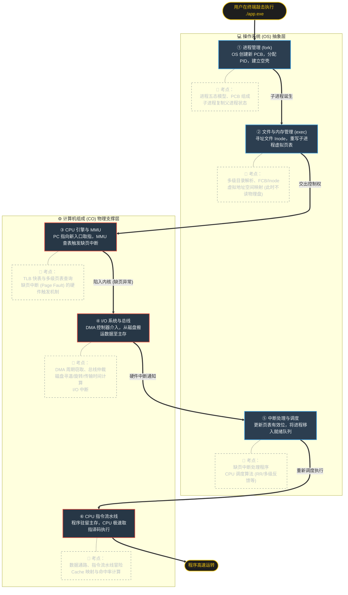
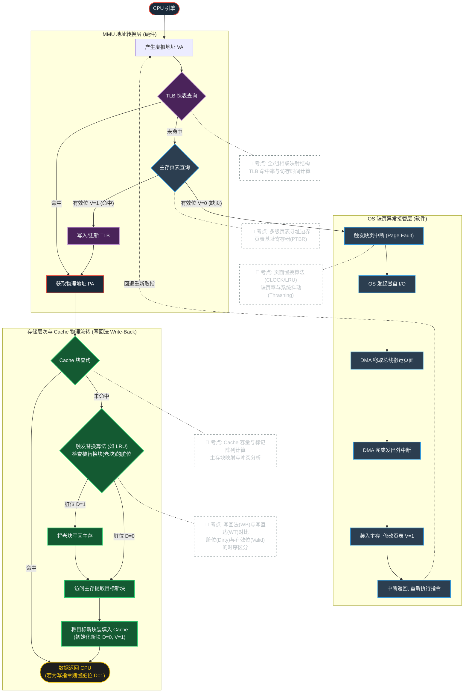
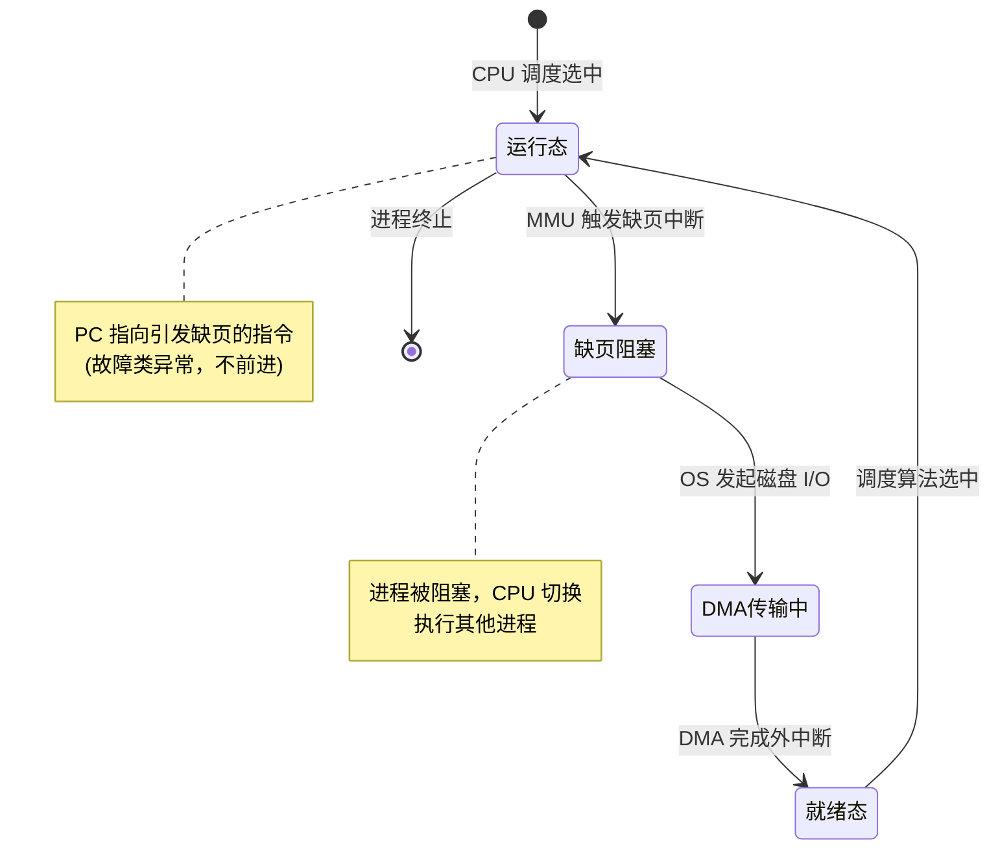

# 计组与操作系统：软硬协同全链路

> 本篇缝合自 `CO-OS-1`（全链路概览）与 `CO-OS-2`（微观时序深潜），覆盖 408 综合大题核心战场。

---

## [~] Ⅰ. 408 软硬协同全链路核心考点

基于程序完整生命周期（`fork` $\to$ `exec` $\to$ 取指 $\to$ 缺页 $\to$ 调度 $\to$ 硬件执行）的深度总结与考点映射。以下内容覆盖 OS 与 CO 两科的**交叉考点**，是 408 综合大题（题 43/47）的核心战场。

---

### [ ] 核心流程与 408 考点映射矩阵

将时序流程剥离为绝对的考点维度，形成高密度知识索引。每一个单元格都必须能在大脑中展开为具体的公式或数据结构。

| 执行阶段                             | 所属域                                 | 核心概念                            | 408 绝杀考点 / 计算题型                                                                                                                                                                                                                                                                             |
| :----------------------------------- | :------------------------------------- | :---------------------------------- | :-------------------------------------------------------------------------------------------------------------------------------------------------------------------------------------------------------------------------------------------------------------------------------------------------- |
| **0. 躯壳克隆** (`fork`)          | **OS**: 进程与线程                    | PCB、写时复制、三态/五态转换      | 进程树的资源继承关系。`fork` 返回值：父进程得 **子进程 PID**，子进程得 **0**。进程切换时上下文保存：通用寄存器、PC、PSW、页表 基址寄存器。写时复制 机制：初始共享物理页框，触发写操作时才真正复制。                                                                                               |
| **1. 灵魂替换** (`exec`)          | **OS**: 文件系统 **OS**: 内存管理 | 索引节点、目录解析、虚拟地址空间  | 多级目录的平均访存次数。逻辑空间划分：**$\text{代码段} / \text{数据段} / \text{堆} / \text{栈}$**。`exec` 不分配物理页框——采用 **$\text{延迟分配}$** 机制，直到实际访问才触发缺页。                                                                                                                 |
| **2. 虚实转换** (MMU 查表)        | **OS/CO 跨界** (存储系统)          | MMU、TLB、页表、地址转换         | **高频大题**：虚拟地址拆分：左边静态、右边遮罩：$\text{虚页号} + \text{页内偏移} =$ **$\text{虚拟地址}$** TLB 组相联映射查表流程。页表项结构：**$\text{帧号} + \text{有效位} + \text{修改位} + \text{访问位}$**。多级页表级数计算：$n = \lceil \log_2(\text{页表大小} / \text{页大小}) \rceil$。 |
| **3. 缺页拦截** (陷入内核)        | **OS**: 内存管理                      | 缺页中断、页面置换算法            | 属于 **内中断（异常）** 而非外中断。处理流程：合法性检查 $\to$ 找空闲帧 $\to$ 无空闲则执行置换 $\to$ 从磁盘读入 $\to$ 更新页表。LRU/CLOCK 算法缺页率计算。Belady异常：FIFO 中增加帧数反而可能增加缺页。                                                                                            |
| **4. 物理搬砖** (磁盘 $\to$ 主存) | **CO**: I/O管理 **OS**: 文件系统  | DMA、周期窃取、总线仲裁、外中断    | **高频大题**：磁盘访问时间 $=$ **$\text{寻道时间} + \text{旋转延迟} + \text{传输时间}$**。DMA 工作流程：CPU 预设参数 $\to$ DMA 独立搬运 $\to$ 完成后发中断通知。总线带宽占比计算。                                                                                                                  |
| **5. 引擎狂飙** (指令执行)        | **CO**: CPU **CO**: 存储系统      | 指令流水线、数据通路、Cache 映射 | **高频大题**：流水线数据冒险（**RAW** / WAR / WAW）$\to$ 转发或阻塞。Cache 直接/全相联/组相联映射规则及命中率计算。有效 CPI $= \text{基础 CPI} + \text{缺失率} \times$ **缺失惩罚**。                                                                                                               |

> **⚠️ 易错辨析**
>
> - **fork 的写时复制**：父子进程最初共享物理页框，一旦某方执行**写操作**，MMU 检测到页表项的**只读保护位**被触发，此时才真正复制该页。不要误以为 `fork` 时就全盘复制内存。
> - **缺页中断 vs 一般中断**：缺页属于**内中断（异常）**，在指令执行**过程中**产生；DMA 完成中断属于**外中断**，在指令执行**之间**检测。两者的响应时机完全不同。
> - **TLB vs Cache**：TLB 缓存的是**虚拟页号到物理帧号的映射**，Cache 缓存的是**主存数据块的副本**。二者层次不同，但经常出现在同一道综合大题中。

<!-- 以下由 AI 补充：节末自测 -->

> **📝 Ⅰ 节自测**
>
> 1. `fork` 返回后，父进程得到的返回值是 **子进程 PID**，子进程得到的是 **0**。
> 2. 页表项至少包含哪些字段？**$\text{帧号} + \text{有效位} + \text{修改位} + \text{访问位}$**。
> 3. 缺页中断属于哪一类中断？它的检测时机与普通外中断有何不同？
>    答案：属于 **内中断（异常）**，在指令执行**过程中**产生；外中断在指令执行**之间**检测。

---

## [ ] Ⅱ. 虚实边界：MMU 地址转换与缺页拦截

> 对应全链路中的步骤 ③（CPU 引擎与 MMU）+ 步骤 ④（I/O 系统与总线）+ 步骤 ⑤（中断处理与调度）。

虚拟地址（$\text{VA}$）到物理地址（$\text{PA}$）的转换，是横跨计算机组成原理（硬件）与操作系统（软件调度）的核心关卡。

### [ ] 硬件极速通关：TLB 命中

CPU 产生 $\text{VA}$，首先并行或串行查询快表（TLB）。若命中，直接斩获物理地址 $\text{PA}$，这是最理想的零延迟状态。

### [ ] 硬件降级通关：TLB 未命中，页表命中

若 TLB Miss，MMU 硬件根据 页表 基址寄存器（PTBR）自动去主存查页表。若对应页表项有效位 $V=1$，获取 $\text{PA}$，并**必须回填更新 TLB**。

> **⚠️ 致命概念防坑**
> **查页表是谁的工作？** 绝大多数现代 CPU 中，**查页表是 MMU（硬件）的工作，不是 OS！** 只有查不到（缺页）或者越权访问时，OS 才会被动介入。
> **缺页后的 PC 指针**：缺页异常属于"故障（Fault）"，中断返回后 PC 指向的是**引发故障的当前指令**，而不是下一条指令！

### [ ] 软件兜底劫持：缺页中断

若主存页表有效位 $V=0$，说明页面根本不在内存。硬件 MMU 立即触发**缺页中断（内中断/异常）**，执行流砸入 OS 内核态：

1. OS 下发命令，利用 DMA 周期窃取机制从磁盘搬运页面。
2. DMA 完成后发出**外中断**通知 OS。
3. OS 更新主存页表置 $V=1$，随后中断返回（$\text{IRET}$），**CPU 重新执行刚才引发缺页的那条指令**。

### [ ] 缺页与调度的完整状态机

<!-- 以下由 AI 补充：扩展状态机 -->

缺页中断触发后，进程进入完整的状态流转轨道，与 进程与线程 的五态模型深度关联：

**完整流转**：缺页 $\to$ 进程**阻塞** $\to$ DMA 传输 $\to$ DMA 完成中断 $\to$ 进程**就绪** $\to$ 调度上 CPU $\to$ 重新执行引发缺页的那条指令。

<!-- 以下由 AI 补充：节末自测 -->

> **📝 Ⅱ 节自测**
>
> 1. 缺页中断发生后，中断返回时 PC 指向哪条指令？
>    答案：**引发缺页的当前指令**（缺页属于 Fault，不是 Trap）。
> 2. 缺页中断导致进程状态如何变化？**运行态 $\to$ 阻塞态**。
> 3. TLB 未命中时，由谁负责查询主存页表？**MMU（硬件）**，不是 OS。

---

## [ ] Ⅲ. 存储层次突围：Cache 写回法微观时序

> 对应全链路步骤 ⑥（指令流水线执行）中与存储系统的交互细节。

获取到物理地址 $\text{PA}$ 后，进入 Cache 层级。考研极高频考查 **写回法（Write-Back）** 与 **替换算法（如 LRU）** 的时序纠缠。

### [ ] 写回法全流程三阶段

**阶段一：极速命中 (Hit)**

绝对不碰主存。若指令为写入操作，则将该 Cache 行的**脏位（Dirty Bit）** 置为 $D=1$，表示与主存数据不一致。

**阶段二：未命中踢出 (Miss & Replace)**

Cache 满了，必须选一个老块（Victim）牺牲。此时**必须且只能检查老块的脏位**：

- **老块 $D=1$**：说明老块被改过，必须先把它**写回主存**，再从主存把新块读入 Cache（**两次主存访问** — 一写一读）。
- **老块 $D=0$**：老块与主存一致，直接丢弃，从主存读取新块覆盖（**一次主存访问** — 只读）。

**阶段三：新块装填 (Fill)**

新块入驻 Cache 后，必须初始化其标志位：**有效位 $V=1$，脏位 $D=0$**。

> **💡 破阵口诀**
> **脏位只看老，写回不看新。** Cache Miss 时，惩罚最大的情况是"未命中且替换块为脏块"，此时需要进行两次主存访问（一写一读）。

### [ ] 写回法 vs 写直达法对比

<!-- 以下由 AI 补充：对比维度 -->

| 对比维度         | 写回法 (Write-Back)                      | 写直达法 (Write-Through)         |
| :--------------- | :--------------------------------------- | :------------------------------- |
| **写命中策略**   | 只写 Cache，置脏位 $D=1$                 | 同时写 Cache 和主存              |
| **写未命中策略** | 先加载块到 Cache，再写 Cache（取一写一） | 通常直接写主存（不加载到 Cache） |
| **脏位**         | ✅ 需要                                  | ❌ 不需要                        |
| **主存访问次数** | 少，只有替换脏块时才写回                 | 多，每次写操作都写主存           |
| **优缺点**       | 节省带宽，但替换时延迟大                 | 一致性易维护，但带宽消耗大       |
| **408 命题倾向** | ⭐⭐⭐ 极高（配合 Cache 容量计算）       | ⭐⭐ 中等（常出现在对比题）      |

### [ ] Cache 总容量计算

> **⚠️ 高频陷阱**
> 计算 Cache 总容量时，绝不能只算数据区！

**总容量 $= \text{行数} \times (\text{有效位} + \text{脏位} + \text{替换控制位} + \text{Tag 位} + \text{数据块大小})$**

**考题模板**：某 Cache 采用 8 路组相联，块大小 64B，共 32KB，采用 LRU 替换策略（需要 **$\lceil \log_2 8 \rceil = 3$** 位替换控制位），则每行 Tag 位数 = **$\text{物理地址位数} - \text{组索引位数} - \text{块内偏移位数}$**。

<!-- 以下由 AI 补充：节末自测 -->

> **📝 Ⅲ 节自测**
>
> 1. 写回法下，Cache Miss 时发生两次主存访问的条件是什么？
>    答案：被替换的 **老块脏位 $D=1$**（一写一回，再读新块）。
> 2. 写直达法为什么不需要脏位？因为每次写操作都 **同时写 Cache 和主存**，不会出现不一致。
> 3. 计算：32KB Cache，8 路组相联，块大小 64B，物理地址 32 位，则每行 Tag 占多少位？
>    答案：组数 $= 32\text{KB} / 8 / 64\text{B} = 64$ 组，组索引 $= \lceil \log_2 64 \rceil = 7$ 位，块内偏移 $= \lceil \log_2 64 \rceil = 6$ 位，Tag $= 32 - 7 - 6 =$ **19** 位。

---

## [ ] Ⅳ. 考点的多维关联 (The Nexus Points)

408 综合大题极少单独考察某一章节，而是围绕以下三个**跨界枢纽**命题：

### [ ] 关联一：寻址体系的"三重门"

- **逻辑链**：变量名 $\to$ 编译器生成的**逻辑地址 / 虚拟地址** (OS) $\to$ MMU 转换出的**主存物理地址** (CO) $\to$ 映射到 **Cache 行号** (CO)。
- **地址拆分实例**（32 位系统，4KB 页面，4B 页表项）：
  - 页内偏移 $= \log_2(4096) = $ **$12$** 位
  - 虚页号 $= 32 - 12 = $ **$20$** 位
  - 页表项数 $= 2^{20} = $ **$1\text{M}$** 项
  - 页表总大小 $= 1\text{M} \times 4\text{B} = $ **$4\text{MB}$**
- **大题套路**：给出 `for` 循环遍历数组的代码，要求结合数组大小、页面大小、Cache 行大小，计算缺页次数与 Cache 命中率。核心在于**看懂地址的位宽拆分**。

**跨科链接**：此处的地址拆分与 [[存储系统]] 中的 Cache 组相联映射、[[内存管理]] 中的多级页表深度绑定。

> **📝 跨科思考：CO ↔ 数学**
> 页表级数公式 $n = \lceil \log_2(\text{页表总大小} / \text{页大小}) \rceil$ 的本质是信息论中的什么思想？—— 对数量纲匹配，每一级页表相当于一次"除基取余"的维度压缩。

### [ ] 关联二：中断与异常的"驱动轴"

OS 是一个"死循环"，全靠中断驱动。必须厘清两类中断的本质区别：

| 对比维度 | 内中断（异常）                        | 外中断（硬件中断）                     |
| :------- | :------------------------------------ | :------------------------------------- |
| 触发源   | CPU 内部：非法指令、除零、**缺页**    | 外部设备：DMA 完成、时钟、键盘         |
| 检测时机 | 指令执行**过程中**                    | 指令执行**之间**（每条指令结束时检测） |
| 处理模块 | OS 内存管理（缺页处理程序）           | OS 进程调度 / I/O 管理                 |
| 典型流转 | 缺页 $\to$ 阻塞 $\to$ 换页 $\to$ 就绪 | DMA 完成 $\to$ 中断 $\to$ 唤醒等待进程 |

**跨科链接**：中断系统与 [[cpu-与流水线]] 中的异常处理机制、[[总线与-i-o-系统]] 中的中断响应周期紧密关联。

> **📝 跨科思考：CO ↔ OS**
> 缺页中断的响应流程中，为何 CPU 在 I/O 传输期间不空转而是切换进程执行？这依赖于 [[进程与线程]] 中的什么机制？—— **上下文切换** 与 **就绪队列调度**。

### [ ] 关联三：并发与阻塞的"时空"

当进程因缺页或 I/O 阻塞时，CPU 不会闲着——OS 立即切换其他进程上 CPU：

- **CPU 利用率**：$\eta = \dfrac{\text{CPU 有效工作时间}}{\text{CPU 有效工作时间} + \text{I/O 等待时间} + \text{上下文切换开销}}$
- **大题套路**：常结合甘特图，考察多程序并发执行时总执行时间的缩短量。关键认知：I/O 设备与 CPU 可以**并行**工作。
- **上下文切换开销**：保存/恢复寄存器、切换 页表 基址寄存器、刷新 **TLB**。这是多道程序设计的代价。

**跨科链接**：并发调度模型与 [[死锁]] 中的资源分配图、[[进程与线程]] 中的调度算法形成综合大题的知识三角。

<!-- 自测 -->

> **📝 Ⅳ 节自测**
>
> 1. CPU 利用率公式中的三项分别是什么？
>    答案：**CPU 有效工作时间**、**I/O 等待时间**、**上下文切换开销**。
> 2. 缺页中断的完整状态机：**运行态 $\to$ 阻塞态 $\to$ 就绪态 $\to$ 运行态**。

---

## [x] Ⅴ. 核心大题考点矩阵

基于以上内容，以下是应对题 47 综合大题的火力配置表：

| 物理节点          | 考纲核心知识点                     | 命题陷阱与计算要点                                                                                                                                                                                    |
| :---------------- | :--------------------------------- | :---------------------------------------------------------------------------------------------------------------------------------------------------------------------------------------------------- |
| **TLB 快表**      | 全相联/组相联映射、命中率计算      | 若题干说"TLB 采用全相联"，这意味着**虚拟页号 (VPN) 直接作为 Tag 对比**，无需拆分 Index。注意 TLB 访问时间是否与 Cache 并行。                                                                         |
| **主存页表**      | 多级页表边界、页目录与页表大小计算 | 计算时警惕"页表项大小"与"页面大小"。例如 4KB 页面，4B 页表项，则一页可装 $1\text{K}$ 个页表项，切分虚拟地址时对应 $10\text{ bit}$。                                                                   |
| **缺页异常**      | 页面置换算法 (CLOCK / LRU)、缺页率 | 遇到 CLOCK 算法，必须在草稿纸上画环形队列，严格维护 `(访问位, 修改位)`，如 `(0,0)` 优先淘汰，扫描不到再降级。关联 [[内存管理]] 的页面置换策略。                                                   |
| **替换与写回**    | 写回法 (WB) vs 写直达 (WT)         | WT 策略下只要写操作命中，必须同时写 Cache 和主存（无脏位）；WB 策略下仅写 Cache，只有块被替换时才写主存。                                                                                             |
| **Cache 映射**    | 容量计算、主存块映射、命中率       | 计算 Cache 总容量时，绝不能只算数据区！**总容量 $= \text{行数} \times (\text{有效位} + \text{脏位} + \text{替换控制位} + \text{Tag 位} + \text{数据块大小})$**。关联 [[存储系统]] 的 Cache 计算。 |
| **地址转换**      | 虚地址 $\to$ 物理地址全过程        | 综合题典型三段式：①拆虚拟地址 ②查 TLB + 页表 ③计算物理地址访 Cache。输入输出必须厘清 **$\text{VPN} + \text{Offset}$** 的位宽分配。                                                                    |
| **磁盘 I/O 时间** | DMA 与中断协同                     | 磁盘访问时间 $=$ **$\text{寻道时间} + \text{旋转延迟} + \text{传输时间}$**。关联 [[总线与-i-o-系统]] 的 DMA 与中断对比。                                                                          |

---

## [x] Ⅵ. 全局本质总结

> **💡 架构师底层直觉**
> 纵观整个软硬协同网络，其核心矛盾是：**"软件对无限资源的贪婪 vs 硬件对物理极限的妥协"**。
>
> - **OS** 负责制造"幻觉"：通过 页表 制造内存无限大的幻觉；通过进程调度制造 CPU 独占的幻觉。
> - **CO** 负责管理"现实"：主存很慢、磁盘极慢。所以必须用 Cache 缓解 CPU 与主存的鸿沟，用 DMA 缓解 CPU 与外设的鸿沟。
>
> **两者的交汇点，就是 408 最难的综合大题阵眼。** 请将 页表、TLB、Cache 和 DMA 标记为最高优先级战备节点。

### [x] 公式速查

| 公式               | 表达式                                                                                                                     |
| :----------------- | :------------------------------------------------------------------------------------------------------------------------- |
| CPU执行时间       | $T = \dfrac{\text{IC} \times \text{CPI}}{f}$                                                                               |
| 磁盘访问时间       | $T_{\text{disk}} = T_{\text{seek}} + T_{\text{rotate}} + T_{\text{transfer}}$                                              |
| Cache 平均访问时间 | $T_{\text{avg}} = \text{命中时间} + \text{缺失率} \times \text{缺失惩罚}$                                                  |
| 含存储停滞的 CPI   | $\text{CPI}_{\text{eff}} = \text{CPI}_{\text{base}} + \text{每条指令缺失次数} \times \text{缺失惩罚}$                      |
| 页表级数上取整     | $n = \lceil \log_2(\text{页表总大小} / \text{页大小}) \rceil$                                                              |
| Cache 总容量       | $\text{总容量} = \text{行数} \times (\text{有效位} + \text{脏位} + \text{替换控制位} + \text{Tag 位} + \text{数据块大小})$ |

### [x] 真题闭环

> **📝 真题闭环**
> 某计算机采用 32 位虚拟地址，页面大小 4KB，页表项 4B。TLB 采用 4 路组相联共 64 项。Cache 采用 8 路组相联，块大小 64B，共 32KB。
>
> 1. 虚拟地址中虚页号占多少位？答案：**$20$** 位
> 2. TLB 组号占多少位？答案：**$4$** 位（64 项 / 4 路 $= 16$ 组，$\log_2 16 = 4$）
> 3. 物理地址中 Cache 组号占多少位？答案：**$7$** 位（32KB / 8 路 / 64B $= 64$ 组，$\log_2 64 = 7$）

### [x] 知识图谱关联

> **📝 跨科终极思考**
> 从"用户敲击回车"到"屏幕上输出结果"，经历了多少次地址转换和中断响应？
>
> 1. 用户在 shell 输入命令：[[文件系统]] 读取命令路径涉及 **多级目录解析**。
> 2. `fork` 创建子进程：[[进程与线程]] 的 **写时复制** 机制避免物理内存的冗余复制。
> 3. `exec` 加载可执行文件：[[内存管理]] 的 **虚拟地址空间** 重构与 **延迟分配**。
> 4. 取第一条指令触发缺页：MMU 查 页表 $\to$ TLB 未命中 $\to$ 页表缺页 $\to$ 触发 **缺页中断**。
> 5. 磁盘 DMA 搬入页面：[[总线与-i-o-系统]] 的 **DMA 周期窃取** 与 **外中断**。
> 6. 指令连续执行：[[cpu-与流水线]] 的 **指令流水线** 与 [[存储系统]] 的 **Cache 映射**。
>
> **最终总结：一次"简单"的程序运行，背后是 OS 的抽象幻觉与 CO 的物理现实之间无数次博弈。**

