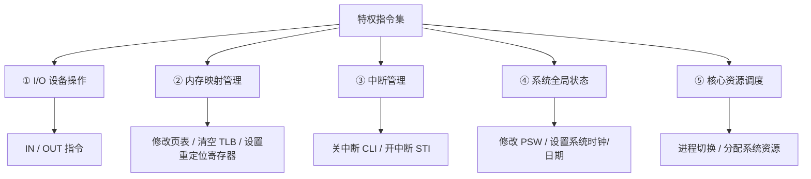
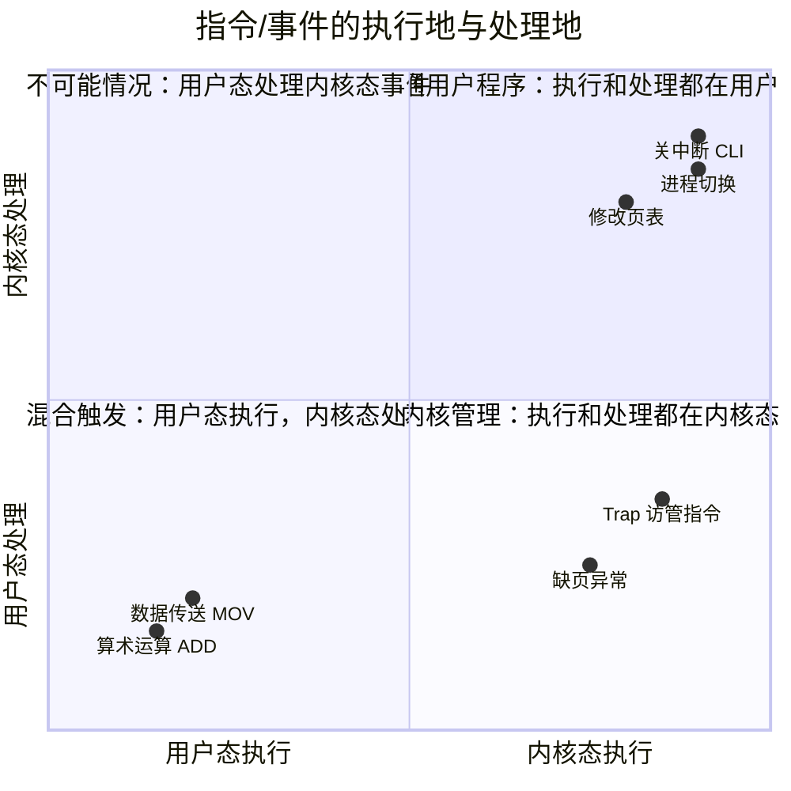
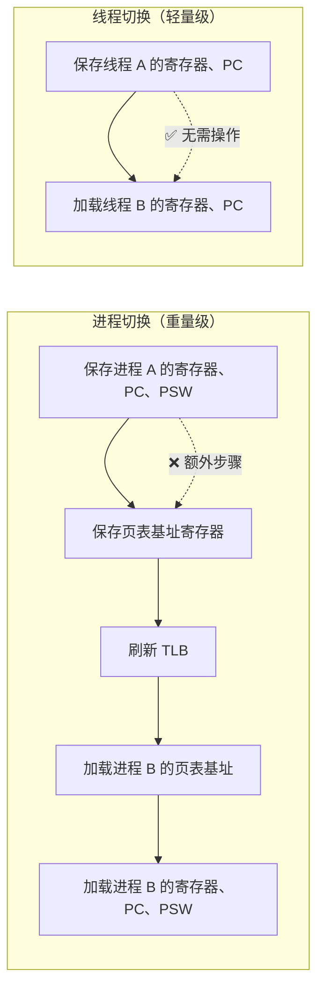

# OS 弱点辨析手册：对比驱动型知识卡

> 本册专攻 OS 中最易混淆、最常踩坑的核心辨析点。每个模块的核心打法：**把两张相似概念贴在一起，让你一眼看出区别**。

---

## 模块一：指令权限 · 三阶分类与边界案例

### Ⅰ. 第一阶：一刀切大分类

判断一条指令是特权还是非特权，只问一个问题：**"执行后会不会破坏别人的沙盒，或弄瞎系统的眼睛？"**

| 类别           | 核心特征                                        | 口诀                         | 执行地点                |
| :------------- | :---------------------------------------------- | :--------------------------- | :---------------------- |
| **特权指令**   | 影响全局硬件、修改物理内存映射、改变 CPU 控制权 | **"管硬件、管全局、管别人"** | 内核态（管态 / Ring 0） |
| **非特权指令** | 只在当前进程的逻辑空间折腾，最多卡死自己        | **"管自己、算算数"**         | 用户态（目态 / Ring 3） |

---

### Ⅱ. 第二阶：特权指令内部五大家族

| 家族             | 典型指令                                | 为什么必须特权？                                        |
| :--------------- | :-------------------------------------- | :------------------------------------------------------ |
| **I/O 设备操作** | `IN`、`OUT`                             | 外设全系统共享，用户程序不能直接控制网卡/硬盘           |
| **内存映射管理** | 修改页表、清空 TLB、设置基址/限长寄存器 | 允许用户改页表 = 允许它读别人内存密码                   |
| **中断管理**     | `CLI`（关中断）、`STI`（开中断）        | 中断是 OS 夺回 CPU 的唯一武器，用户不能关掉 OS 的"耳朵" |
| **系统全局状态** | 修改 PSW、**设置**系统时钟/日期         | 全局状态变更会影响所有进程                              |
| **核心资源调度** | 进程切换、分配/回收物理资源             | 资源分配必须由 OS 统一管理                              |

---

### Ⅲ. 第三阶：高频边界案例对比（最容易混淆的陷阱）

**对比 1：「读取」vs「写入」系统状态**

| 操作                  | 指令示例  | 权限归属      | 原因                     |
| :-------------------- | :-------- | :------------ | :----------------------- |
| **读取**当前时钟周期  | `RDTSC`   | ✅ **非特权** | 只是看时间，不影响任何人 |
| **设置**系统时钟/日期 | `SETTIME` | ❌ **特权**   | 改了所有进程的时间感知   |

**对比 2：「清空自己的」vs「清空全局的」**

| 操作                     | 指令示例             | 权限归属      | 原因                            |
| :----------------------- | :------------------- | :------------ | :------------------------------ |
| 清空自己的**通用寄存器** | `MOV R0, 0`          | ✅ **非特权** | 只折腾自己的沙盒                |
| 清空**TLB（快表）**      | `TLB flush`/`INVLPG` | ❌ **特权**   | 清空 TLB 影响整个系统的地址映射 |

**对比 3：「普通运算」vs「涉及核心寄存器的操作」**

| 操作                                         | 权限归属      | 原因                                      |
| :------------------------------------------- | :------------ | :---------------------------------------- |
| 算术运算（`ADD`、`DIV`）                     | ✅ **非特权** | 纯计算，无关全局                          |
| 程序控制转移（`JMP`、`CALL`、`PUSH`、`POP`） | ✅ **非特权** | 只改自己的 PC 和栈                        |
| **修改 PSW**（程序状态字）                   | ❌ **特权**   | PSW 保存 CPU 状态，改了等于篡改系统全局位 |

**对比 4：最致命的陷阱——访管指令（Trap / Syscall）**

| 维度            | 说明                                                                                       |
| :-------------- | :----------------------------------------------------------------------------------------- |
| **本质**        | 用户程序**主动**呼叫 OS 帮忙的指令（如请求读写文件）                                       |
| ❌ **易错点**   | 很多人误以为"它会导致切换到内核态，所以是特权指令"                                         |
| ✅ **正确认知** | 它是一条**非特权指令**！但它的**执行效果**是触发内部中断，迫使 CPU 切换到内核态            |
| **类比**        | 就像你**按门铃**（非特权动作），但门铃响了后**主人来开门**（内核态处理）——按门铃本身不违法 |

> **⚠️ 致命公式**
> **访管指令 = 非特权指令（执行位置） + 触发内核态切换（执行效果）**

---

### Ⅳ. 考场秒杀决策树

**指令特权秒杀判定表**（按顺序逐问过滤，命中即停）：

| 判定顺序 | 若"是" → 结论 | 若"否" |
|---|---|---|
| ① 是算术 / 赋值 / 数据传送 / 跳转？ | ✅ **非特权指令**（用户态执行） | 进 ② |
| ② 是 Trap / 访管指令 / Syscall？ | ✅ **非特权指令**，但触发内部中断 → 切换内核态 | 进 ③ |
| ③ 直接操作 I/O / 页表·TLB / 中断开关 / PSW·时钟 / 进程调度 之一？ | ❌ **绝对特权指令**（内核态执行） | ⚠️ 边界案例，套上方对比表 |

---

### Ⅴ. 状态切换定律：谁主动、谁被动

| 切换方向            | 触发方式        | 谁发起的 | 典型事件                                      |
| :------------------ | :-------------- | :------- | :-------------------------------------------- |
| **用户态 → 内核态** | 被动的 / 间接的 | 硬件强制 | 中断（外设）、异常（缺页/除零/Trap）          |
| **内核态 → 用户态** | 主动的          | OS 自己  | OS 执行**特权指令**（如修改 PSW），交还控制权 |

> **💡 底层直觉**
> **"进去是被迫的，出来是主动的。"** 用户程序永远无法自己"主动"进入内核态——它只能通过 Trap 说"请帮我"，至于帮不帮、什么时候帮，由 OS 决定。

## 模块二：「指令执行地 vs 处理地」四象限矩阵

### 核心辨析：事件在哪里发生 vs 在哪里被处理

- **Ⅰ 普通用户区**：执行地 = 用户态；处理地 = 用户态。
  典型代表是算术运算、`MOV`、`JMP`，完全在用户空间完成。
- **Ⅱ 不可能区**：执行地 = 内核态；处理地 = 用户态。
  进了内核态就不可能把控制权交给用户来处理。
- **Ⅲ 混合触发区**：执行地 = **用户态**；处理地 = **内核态**。
  典型代表是 Trap、缺页、除零。命题陷阱是：事件发生在用户态，但由 OS 在内核态处理。
- **Ⅳ 内核管理区**：执行地 = 内核态；处理地 = 内核态。
  典型代表是修改页表、`CLI`、进程切换，完全在内核域完成。

> **⚠️ 陷阱总结**
> 408 最爱考 **象限 Ⅲ（混合触发区）**：问你"xxx 在哪里执行"——答案是**用户态**，不要被"它最后切换到了内核态"迷惑。

---

## 模块三：四大 OS 阵营 · 需求驱动演进对比链

### 核心逻辑：每一种新系统的诞生，都是为了解决上一代最让人无法忍受的痛点

---

### Ⅰ. 两两直面对比

**对比 1：单道批处理 vs 多道批处理**

| 对比维度         | 单道批处理                     | 多道批处理                           |
| :--------------- | :----------------------------- | :----------------------------------- |
| **内存程序数**   | 1 道                           | 多道（并发）                         |
| **CPU 利用率**   | ❌ **极低**（I/O 时 CPU 空转） | ✅ **大幅提升**（A I/O 时 CPU 跑 B） |
| **核心概念诞生** | 监督程序（Monitor）            | **进程 / 并发**                      |
| **交互性**       | 无                             | 无                                   |
| **首要追求**     | 自动平滑过渡                   | **吞吐量、资源利用率**               |
| **致命弱点**     | CPU 利用率低                   | 完全失去交互（用户只能等几小时）     |

**对比 2：多道批处理 vs 分时系统**

| 对比维度       | 多道批处理                | 分时系统                      |
| :------------- | :------------------------ | :---------------------------- |
| **调度方式**   | 无抢占（遇到 I/O 才切）   | **时间片轮转**（公平轮询）    |
| **核心目标**   | **吞吐量最大化**          | **人机交互、响应及时性**      |
| **交互性**     | ❌ 无（黑盒提交）         | ✅ **极强**（多终端对话）     |
| **响应时间**   | 小时级                    | **秒级**（人类可接受）        |
| **CPU 吞吐量** | ✅ **最高**（无切换开销） | ❌ **下降**（频繁上下文切换） |
| **典型场景**   | 大型科学计算、数据跑批    | Unix/Linux 服务器、日常 PC    |

> **⚠️ 核心矛盾**
> **吞吐量与交互性不可兼得。** 多道批处理牺牲了交互换吞吐，分时系统牺牲了吞吐换交互。

**对比 3：分时系统 vs 实时系统**

| 对比维度       | 分时系统                     | 实时系统                                          |
| :------------- | :--------------------------- | :------------------------------------------------ |
| **调度依据**   | 公平时间片                   | **绝对优先级**（紧急任务优先）                    |
| **时间标尺**   | **及时性**（秒级，人类反应） | **实时性**（毫秒/微秒级，物理限制）               |
| **超时后果**   | 用户多等几秒                 | **灾难**（导弹偏离 / 车床报废）                   |
| **交互性**     | 极强（多用户终端）           | 弱（仅限特定控制命令）                            |
| **可靠性追求** | 一般                         | **极致的可靠性**                                  |
| **分类**       | —                            | **硬实时**（绝不超时）vs **软实时**（偶尔可接受） |

> **⚠️ 「及时性」vs「实时性」——一字之差，天壤之别**
>
> - **及时性（分时）**：以"人类反应时间"为标尺（秒级）。你敲键盘，屏幕立刻出字。
> - **实时性（实时）**：以"机器物理限制"为标尺（毫秒/微秒级）。雷达发现目标，必须在 50ms 内发射拦截。
>
> **分时慢了 → 用户体验差；实时慢了 → 系统崩溃。**

---

### Ⅱ. 四大阵营全景速查表

| 系统类型 | 首要追求 | 调度方式 | 记忆 |
| :--- | :--- | :--- | :--- |
| **单道批处理** | 自动平滑过渡 | 顺序串行 | 串行等，CPU 闲 |
| **多道批处理** | **吞吐量、资源利用率** | 无抢占并发 | 并发跑，交互无 |
| **分时系统** | **人机交互、响应时间** | **时间片轮转** | 时间片，人人有 |
| **实时系统** | **截止时间、可靠性** | 绝对优先级抢占 | 死线到，必须完 |

- **交互性**：单道批处理、多道批处理均无交互；分时系统交互性最强；实时系统只保留弱交互。
- **典型场景**：单道批处理对应早期电子管计算机；多道批处理对应大型科学计算、数据跑批；分时系统对应 Unix/Linux、日常 PC；实时系统对应武器控制、工业自动化。

---

### Ⅲ. 场景判断流程图

**OS 类型选择判定表**（按"是否需要人机交互"分两支）：

**A. 无交互分支**（考吞吐 / 利用率）：

| 一次只跑一个程序？ | → 选择 |
|---|---|
| 是 | **单道批处理** |
| 否（多道并发） | **多道批处理** |

**B. 有交互分支**（考响应 / 实时）：

| 有严格截止时间？ | 超时会导致灾难？ | → 选择 |
|---|---|---|
| 否 | — | **分时系统** |
| 是 | 是 | **硬实时系统** |
| 是 | 否（偶尔可接受） | **软实时系统** |

---

### Ⅳ. 408 命题陷阱 TOP 3

> **⚠️ 陷阱 1：「吞吐量最大」≠ 「效率最高」**
> 题目问"什么系统能最大化吞吐量？"→ **多道批处理**（无交互打断，CPU 满负荷）。
>
> 但注意：吞吐量最大不代表"每个任务执行得快"，单个任务在多道批处理中可能因为等待 I/O 而变慢。

> **⚠️ 陷阱 2：「分时系统」的四大特征——少一个都不行**
> 分时系统的 **四性**（408 极高频）：
>
> 1. **多路性** — 一台主机连多个终端
> 2. **交互性** — 用户可与系统随时对话
> 3. **独立性** — 用户感觉"独占"了系统（❗ 是假象，所以叫独立性，**绝对不能叫独占性**）
> 4. **及时性** — 秒级响应
>
> ❌ 常见错误：把"独立性"写成"独占性"，或漏掉其中一个。

> **⚠️ 陷阱 3：「实时系统」的硬/软区分**
> 题目给一个场景，问属于哪类实时系统：
>
> - **硬实时**：超时 = 系统失败（导弹控制、汽车安全气囊、医疗起搏器）
> - **软实时**：超时 = 质量下降但系统仍可用（视频播放、在线游戏、语音通话）

---

## 模块四：进程 vs 线程 · 资源与调度的所有权之争

### Ⅰ. 核心差异全景对比

| 对比维度         | 进程                                   | 线程                                       |
| :--------------- | :------------------------------------- | :----------------------------------------- |
| **定义**         | 程序的一次执行过程                     | 进程内的执行流                             |
| **资源归属**     | **资源分配的基本单位**（独立地址空间） | **CPU 调度的基本单位**（共享所属进程资源） |
| **地址空间**     | 独立（互不干扰）                       | 共享同一进程的地址空间                     |
| **切换内容**     | 地址空间、页表、内核栈、寄存器         | 程序计数器、寄存器、栈指针                 |
| **切换开销**     | **大**（需刷新 TLB）                   | **小**（无需刷新地址空间）                 |
| **通信方式**     | IPC（管道/消息队列/共享存储/套接字）   | 直接读写共享内存                           |
| **同步需求**     | 进程间无需同步（资源隔离）             | **需要**（共享数据导致竞态条件）           |
| **系统开销**     | 创建/销毁开销大                        | 创建/销毁开销小                            |
| **一个挂了影响** | 不影响其他进程                         | 可能拖垮整个进程                           |

---

### Ⅱ. 切换开销对比：为什么线程"轻量"？

> **💡 记忆口诀**
> **进程切换换"家"（地址空间），线程切换换"座位"（寄存器）。**

---

### Ⅲ. 通信方式对比

| 通信场景               | 可用方式                               | 特点                 |
| :--------------------- | :------------------------------------- | :------------------- |
| **同进程内线程间**     | 共享内存（直接读写全局变量）           | 最快，但需加同步保护 |
| **同一台机器的进程间** | 管道、消息队列、共享存储、信号量、信号 | 需通过 OS 中介       |
| **不同机器的进程间**   | 套接字（Socket）                       | 网络通信             |

---

### Ⅳ. 同步机制辨析

| 同步机制     | 适用场景                 | 核心特点                   |
| :----------- | :----------------------- | :------------------------- |
| **互斥量**   | 保护共享资源的互斥访问   | 只能被一个线程持有         |
| **信号量**   | 控制对共享资源的访问数量 | 计数器机制，可控制多个资源 |
| **条件变量** | 线程等待某个条件满足     | 必须与互斥量配合使用       |

> **⚠️ 高频辨析：互斥量 vs 信号量（二值信号量）**
>
> - 互斥量：**谁锁定谁解锁**，不能跨线程解锁
> - 二值信号量：**可以 A 线程 V 操作、B 线程 P 操作**，更灵活但容易出 bug

---

## 模块五：死锁 · 四大条件与三大策略辨析

### Ⅰ. 核心概念三连击：死锁 vs 饥饿 vs 死循环

| 概念       | 本质                                           | 进程状态 |       能否自行恢复        |
| :--------- | :--------------------------------------------- | :------- | :-----------------------: |
| **死锁**   | 多个进程互相持有对方需要的资源，都在等对方释放 | 阻塞态   |   ❌ 不能（需外力介入）   |
| **饥饿**   | 优先级低的进程长期得不到调度                   | 就绪态   |  ⚠️ 理论上最终可能被调度  |
| **死循环** | 程序逻辑错误，无限执行                         | 运行态   | ❌ 不能（程序本身有 bug） |

> **💡 速记**
> **死锁 = 等在阻塞态，饥饿 = 等在就绪态，死循环 = 跑在运行态。**

---

### Ⅱ. 死锁的四大必要条件（必须同时满足）

| 条件             | 含义                         | 关键点               |
| :--------------- | :--------------------------- | :------------------- |
| **① 互斥**       | 资源一次只能给一个进程用     | 非共享资源           |
| **② 保持并等待** | 进程持有了资源又在等别的资源 | 不放手               |
| **③ 非剥夺**     | 资源不能被 OS 强行抢走       | 只能自愿释放         |
| **④ 循环等待**   | 形成闭合的等待链             | 存在 P1→P2→...→Pn→P1 |

> **⚠️ 陷阱**
> 死锁检测时，**循环等待是必要但不充分条件**——有循环等待不一定死锁（可能还有可用资源）。
> 必须**四大条件同时满足**才算死锁。

---

### Ⅲ. 四大处理策略对比

| 策略         | 思路                     | 典型方法                                                                                                                             | 代价                                   |
| :----------- | :----------------------- | :----------------------------------------------------------------------------------------------------------------------------------- | :------------------------------------- |
| **死锁预防** | 破坏四大条件之一         | ① 打破互斥：资源改为共享（难） ② 打破保持并等待：一次性申请所有资源 ③ 打破非剥夺：资源可被抢占 ④ 打破循环等待：资源按序分配 | **资源利用率极低**（一次性申请太浪费） |
| **死锁避免** | 动态判断，拒绝不安全分配 | **银行家算法**                                                                                                                       | 需预知最大需求量，开销大               |
| **死锁检测** | 允许发生，定期检查       | 资源分配图化简                                                                                                                       | 检测时机难把握                         |
| **死锁解除** | 检测到后强行终止或剥夺   | 终止进程 / 剥夺资源                                                                                                                  | 可能导致数据丢失                       |

> **💡 记忆口诀**
> **预防 = 一开始就不让条件成立**
> **避免 = 每次分配都检查是否安全**
> **检测 = 让死锁发生再发现**
> **解除 = 发现了就强行干掉**

---

### Ⅳ. 银行家算法 vs 资源分配图化简

| 对比维度     | 银行家算法（避免）                  | 资源分配图化简（检测）   |
| :----------- | :---------------------------------- | :----------------------- |
| **时机**     | 分配资源**之前**                    | 分配资源**之后**         |
| **目标**     | 避免进入不安全状态                  | 检测当前是否已死锁       |
| **数据结构** | Available / Max / Allocation / Need | 有向图（进程→资源→进程） |
| **复杂度**   | 需要已知进程最大需求量（苛刻）      | 只需当前分配信息         |
| **408 命题** | ⭐⭐⭐ 高频大题                     | ⭐⭐ 中等频              |

> **⚠️ 易混点**
>
> - 银行家算法是**避免**死锁（在安全和不安全之间反复横跳）
> - 资源分配图化简是**检测**死锁（看化简后是否还有孤立的进程）

---

## 模块六（补充）：易混概念总表

### 一句话区分所有易混对

| 易混对                     | 区分一句话                                                         |
| :------------------------- | :----------------------------------------------------------------- |
| **特权指令 vs 非特权指令** | 碰全局硬件 = 特权；只算自己的 = 非特权                             |
| **访管指令 vs 特权指令**   | Trap 是**非特权指令**，但它**触发内核态切换**                      |
| **及时性 vs 实时性**       | 及时是"人感觉不慢"（秒级），实时是"机器不能超时"（毫秒级）         |
| **分时 vs 实时**           | 分时公平分时间片给所有人，实时紧急任务插队                         |
| **独立性 vs 独占性**       | 独立性是"感觉独占"（假象），独占性是"真的独占"（不存在于分时系统） |
| **进程 vs 线程**           | 进程有独立房子（地址空间），线程是房子里的人                       |
| **进程切换 vs 线程切换**   | 进程换"家"（地址空间+TLB刷新），线程换"座位"（寄存器）             |
| **死锁 vs 饥饿 vs 死循环** | 死锁阻塞态等资源，饥饿就绪态等调度，死循环运行态出不来             |
| **互斥量 vs 信号量**       | 互斥量谁锁谁解，信号量可以 A 锁 B 解                               |
| **死锁预防 vs 死锁避免**   | 预防=硬破坏条件（一刀切），避免=动态检查（银行家）                 |
| **死锁检测 vs 死锁解除**   | 检测=看有没有，解除=有了怎么干掉                                   |

> **📝 综合自测**
>
> 1. `INT n`（访管指令）在哪里执行？答：**用户态**（非特权指令，执行后触发中断进入内核态）
> 2. 修改 PSW 是特权还是非特权？答：**特权指令**（PSW 是系统全局状态）
> 3. 缺页中断在哪检测到？答：**用户态**（指令执行过程中 MMU 发现页表无效位）
> 4. 分时系统追求"及时性"还是"实时性"？答：**及时性**（秒级，以人类反应为标尺）
> 5. 多道批处理的首要追求目标是什么？答：**吞吐量和资源利用率**（不是交互性）
> 6. 进程切换和线程切换，哪个需要刷新 TLB？答：**进程切换**（地址空间变了）
> 7. 死锁的四大条件中，"循环等待"是否等于死锁？答：**不等于**（四大条件必须同时满足）
> 8. 银行家算法属于死锁的哪种处理策略？答：**死锁避免**（动态检查安全性）
