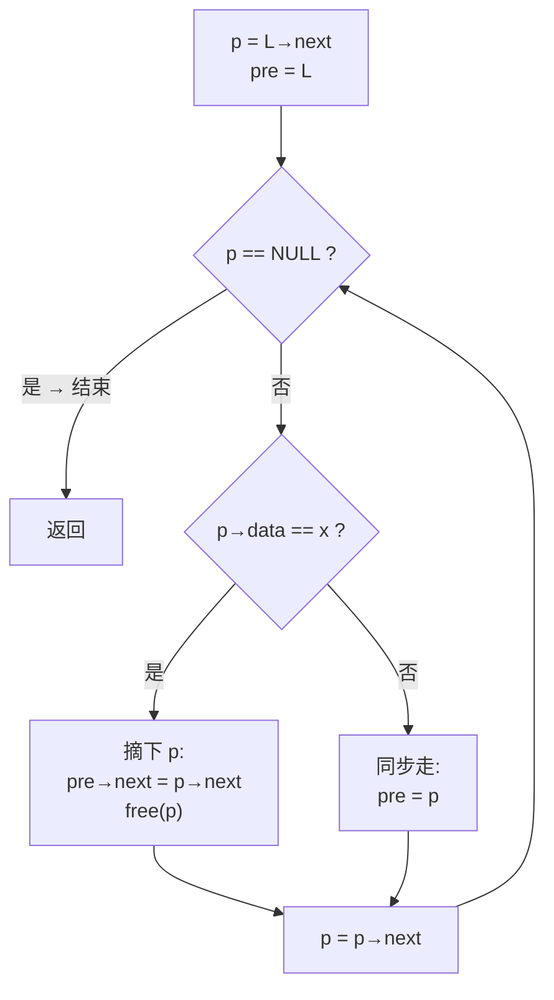

# 错题日记 08 · 数据结构

> 配套 2027 数据结构第 2 章「线性表」链表算法大题（01 删除所有值为 x、02 删除最小值、03 逆置）。

| 题 | 主题 | 解法 | 核心方法 |
|---|---|---|---|
| 题 | 主题 | 解法 | 核心方法 |
|---|---|---|---|
| 01 | 删除所有值为 x | 2 | 扫描删除 / **尾插法过滤重建** |
| 02 | 删除最小值 | 1 | 单次扫描，{minp, minpre} 指针对 |
| 03 | 就地逆置 | 2 | **头插法** / 三指针迭代 |
| 08 | 公共元素 → C（不破坏 A、B） | 1 | 双指针归并 + **malloc 拷贝** |
| 09 | 交集 + 释放（可破坏 A、B） | 1 | 双指针归并 + **复用结点** + free |

## [数据结构] 删除所有值为 x 的结点——pre 没跟上 p（ch-2 q-01）

### Question
在**带头结点**的单链表 L 中，删除所有值为 x 的结点并释放空间（x 不唯一），试编写算法。

### My Answer

```cpp
void Del_X(LinkList &L, ElemType x) {
    LNode *p = L->next, *pre = L, *q;
    while (p != NULL) {           // 原代码写成了 p->next != NULL
        if (p->data == x) {
            q = p;
            p = p->next;
            pre->next = p;
            free(q);
        } else {
            pre = p;              // 原代码漏了这行
            p = p->next;
        }
    }
}
```

> 草稿上是正确的，键盘敲的时候把 `p != NULL` 写成 `p->next != NULL`，把 `else { pre = p; }` 漏了。

### Correct Answer（标准解法）

```cpp
void Del_X(LinkList &L, ElemType x) {
    LNode *p = L->next, *pre = L, *q;
    while (p != NULL) {
        if (p->data == x) {
            q = p;
            p = p->next;
            pre->next = p;
            free(q);
        } else {
            pre = p;           // ⚠️ pre 必须同步前进
            p = p->next;
        }
    }
}
```

**解法 1 · 扫描删除**（上方代码，你已经掌握的）：`p` 从头扫到尾，`pre` 指向前驱。删后 `pre` 不动、`p` 前移（连续 x 天然正确）；不删时 `pre, p` 同步走。

**解法 2 · 尾插法重建**（官方第二解——不是在原链表里删，而是**建新链过滤**）：

```cpp
void Del_X_2(LinkList &L, ElemType x) {
    LNode *p = L->next, *r = L, *q; // r 指向结果链表尾结点
    while (p != NULL) {
        if (p->data != x) {     // ≠x：链接到结果链表尾部
            r->next = p;
            r = p;
            p = p->next;
        } else {                // =x：释放，跳过不链接
            q = p;
            p = p->next;
            free(q);
        }
    }
    r->next = NULL;             // 尾结点 next 置空
}
```



| 对比维度 | 解法 1 · 扫描删除 | 解法 2 · 尾插法重建 |
|---|---|---|
| 思路 | 原地修剪：遇 x 摘除并释放 | 过滤重建：遇 ≠x 链接到结果链 |
| 对连续 x | 天然正确（pre 不动、连续剪） | r 不动、p 跳过 x，连续释放 |
| 原链表结构 | 改动 | **不破坏**原结点 next 关系 |
| 尾结点处理 | 无需特殊处理 | **必须**最后 `r->next = NULL` |
| 不许用 pre 指针 | ❌ 依赖 pre | ✅ 解法 2 可以不依赖 pre |

> 两法时间 O(n)、空间 O(1)。

### Error Pattern
两个都是**草稿 → 键盘的转录损耗**：① `while (p != NULL)` 写成 `while (p->next != NULL)`（最后一个结点跳过，空表崩）；② 删除分支后把 `else { pre = p; }` 漏掉了（不删时 pre 没跟着走，导致后面断链）。

### Core Concept
带头结点单链表的删除通用模板：`p = L->next; pre = L; while (p) { if 删 {pre->next = p->next; free;} else {pre = p;} p = p->next; }`。

### Fix Plan
写完代码后**用"空表 / 单结点 / 连续 x / x在头 / x在尾 / x不存在"六种用例各跑一遍**，循环条件和 pre 更新立刻现形。不要只在脑子里跑"最常见情况"。

### 变式自测
不带头结点的单链表，删除所有值为 x 的结点。答：首结点需特殊处理（`while (L && L->data == x) { q = L; L = L->next; free(q); }`），之后同带头结点。

---

## [数据结构] 删除最小值结点——值/指针混用（ch-2 q-02）

### Question
在**带头结点**的单链表 L 中删除一个最小值结点（假设唯一），试编写**高效**算法。

### My Answer

```cpp
void Del_Min(LinkList &L) {
    LNode *p = L->next, *pre = L;
    LNode mi = L->next;          // ❌ 值拷贝，不是指针
    while (p->next != NULL) {
        if (mi->data > p->next->data) {
            mi->data = p->next->data;  // ❌ 在改数据，没在跟踪结点位置
            pre = p;
        }
        p = p->next;
    }
    pre->next = mi->next;
    free(mi);
}
```

> "哦对我傻了，有点久没写了，应该单独记录值和前指针的。" ——自己回过味来了。

### Correct Answer（高效解法：单次扫描）

```cpp
void Del_Min(LinkList &L) {
    LNode *pre = L, *p = L->next;
    LNode *minpre = L, *minp = L->next;  // 两个指针：最小结点 + 其前驱
    while (p != NULL) {
        if (p->data < minp->data) {
            minp = p;      // 更新最小结点指针
            minpre = pre;  // 更新最小结点的前驱
        }
        pre = p;
        p = p->next;
    }
    minpre->next = minp->next;  // 摘除
    free(minp);
}
```

> **只有一种标准解法**（单次扫描），时间 $O(n)$，空间 $O(1)$。

### Error Pattern
**把"跟踪最小结点位置"写成了"跟踪值"**——`LNode mi` 是栈上拷贝了一个结点结构体，`mi->data` 的覆盖只是改了副本的字段，**原链表里那个真正的最小结点位置根本没有被记录下来**。后面 `free(mi)` 试图释放栈上变量更是崩溃级错误。深层原因是：**"指向最小结点" ≠ "拷贝最小结点的 data"**——结点是一个位置，不是一个值。

| 对比 | ❌ 错误（值拷贝） | ✅ 正确（指针对） |
|---|---|---|
| 记录最小结点 | `LNode mi = L->next`（栈上副本） | `LNode *minp = L->next`（指针） |
| 记录前驱 | 没记 | `LNode *minpre = L` |
| "更新"操作 | `mi->data = p->data`（覆盖副本值，**丢了真位置**） | `minp = p; minpre = pre`（更新指针，不动 data） |
| 删除 | `free(mi)` → 💥 释放栈变量 | `minpre->next = minp->next; free(minp)` ✓ |

### Core Concept
链表找最值的标准模板：`minp`（指向最小结点的指针）+ `minpre`（minp 的前驱），每次遇到更小值时**两个指针同时更新**，不动 `data` 字段。摘除时从 `minpre` 出发。

### Fix Plan
凡是"找最值结点后删除"——立即联想到 **{minp, minpre} 指针对**，把"跟踪位置"和"比较值"分开：比较用 `->data`，记录用指针变量。

### 变式自测
若链表中有**多个相同的最小值**，你的算法会删掉哪一个？若要删掉**最后一个**最小值呢？答：原算法删的是**第一个**（遇到 `<` 更新，所以第一个最小值被记录后不再被更新）。若想删最后一个：改成 `<=` 即可（遇到相等也更新，最终留在末尾最小的位置）。

---

## [数据结构] 单链表就地逆置——两解对照（ch-2 q-03）

### Question
将**带头结点**的单链表 L 就地逆置（不额外申请结点，时间复杂度 $O(n)$，空间 $O(1)$）。

### My Answer（解法 1：头插法）🟢

```cpp
void reverse(LinkList &L) {
    LNode *p = L->next, *q;
    L->next = NULL;
    while (p != NULL) {
        q = p;
        p = p->next;
        q->next = L->next;
        L->next = q;
    }
}
```

**正确。** 这是标准头插法就地逆置。

### Correct Answer（两种官方解法）

**解法 1 · 头插法**（你写的）：摘掉头结点 → 原链表第一结点开始逐个摘下 → 每次插到头结点之后。O(n), O(1)。空表 / 单结点表均安全。

**解法 2 · 三指针迭代法**（RAG 提取）：

```cpp
LinkList Reverse_2(LinkList L) {
    LNode *pre, *p = L->next, *r = p->next;
    p->next = NULL;           // 第一个结点将成为尾结点
    while (r != NULL) {
        pre = p;              // pre 跟上 p
        p = r;                // p 前进
        r = r->next;          // r 前进（保护后继）
        p->next = pre;        // 反转 p 的 next 指针
    }
    L->next = p;              // 头结点指向新首结点
    return L;
}
```

| 对比维度 | 头插法 | 三指针法 |
|---|---|---|
| 核心操作 | 摘结点 → 前插到头后 | pre/p/r 散步 → 逐个反转 next |
| 中间链表形态 | 倒序重建（新结点的 next 不断插到新"头"后） | 原地改向（只旋指针，不摘不插） |
| 头结点 | 先摘掉、当作新链的空头 | 最后一步才指回新首结点 |
| 泛化 | 简单直观、适合全链逆置 | 易移到双链表 / 部分逆置 |
| 复试坑 | — | 可能强迫用此法（"不用头插法重写"） |

> 两法时间 O(n)、空间 O(1)。都会。

### Core Concept
头插法就地逆置：`q=p; p=p->next; q->next=L->next; L->next=q;`（顺序绝对不能乱）。三指针法：pre/p/r 三部曲 + p->next 指向 pre。

### 识别信号
链表逆置 → 优先头插法（你已掌握）。考题附加条件"不改变头结点""只逆置后半截" → 可能逼迫用三指针。记两个，一套一个。

### 变式自测
将单链表从第 k 个结点开始的后半段逆置（前半段不变）。答：定位到第 k-1 个结点 → 后半用头插法或三指针法逆置 → 前半尾结点连到逆置后的新头。

---

## [数据结构] 有序链表公共元素→C——不破坏原链（ch-2 q-08）

### Question
设 A 和 B 是两个**带头结点**的单链表，元素**递增有序**。设计算法从 A、B 中的**公共元素**产生 C，要求**不破坏** A、B 的结点。

### 08 vs 09（两道题只差一个约束）

| | 08 · 不破坏 | 09 · 可破坏 |
|---|---|---|
| 建 C | **malloc 新结点**，拷贝 data | **直接复用** A/B 的匹配结点 |
| A、B 结局 | 完好无损 | 非公共结点**全部释放** |
| 核心一行 | `s = malloc; s->data = p->data; r->next = s;` | `r->next = p;` |

### Correct Answer

```cpp
void Common(LinkList A, LinkList B, LinkList &C) {
    LNode *p = A->next, *q = B->next;
    C = (LinkList)malloc(sizeof(LNode));
    C->next = NULL;
    LNode *r = C, *s;    // r: C 尾指针; s: 新结点

    while (p != NULL && q != NULL) {   // ← p && q, 不是 p->next
        if (p->data == q->data) {
            s = (LNode*)malloc(sizeof(LNode));  // ← 关键: malloc 新结点
            s->data = p->data;                  // 拷贝值
            r->next = s;                        // 尾插到 C
            r = s;
            p = p->next;
            q = q->next;
        } else if (p->data < q->data) {
            p = p->next;
        } else {
            q = q->next;
        }
    }
    r->next = NULL;
}
```

### Core Concept
双指针归并 + malloc 尾插。框架和 01 的解法 2（尾插过滤）同源——区别是 01 过滤的是 **≠x**，08 过滤的是 **相等**。循环条件 `while(p && q)`，不是 `p->next && q->next`。

---

## [数据结构] 有序链表交集——归并 + 释放非公共（ch-2 q-09）

### Question
同 08，但**允许破坏** A、B，且将非公共结点全部释放。

### My Answer
用双指针 pa/pb，比较 data：相等则尾插到 C（复用结点），pa、pb 同步前进；不等则小的那一方前进。任一方到 NULL 则停止。

> 方向全对。`while(p && q)` 写对。尾插思路清晰。

### 你的思路正误对照

| 你写的 | 对/错 | 修正 |
|---|---|---|
| 双指针 pa/pb | 🟢 | — |
| 相等 → 尾插 | 🟢 | 直接 `r->next = p`，不 malloc |
| 小的前进 | 🟢 | **必须同时 `free`**——可破坏时不释放 = 内存泄漏 |
| `p->next != NULL` | 🔴 | → `p != NULL`（尾结点跳过，同 01 bug） |
| 手动 break | 🟡 | 不必要——`while(p && q)` 自动收 |

### Correct Answer

```cpp
void Intersection(LinkList &A, LinkList &B, LinkList &C) {
    LNode *p = A->next, *q = B->next;
    C = A;                  // 复用 A 的头结点作 C 的头
    C->next = NULL;
    LNode *r = C, *u;       // r: C 尾指针; u: 待释放

    while (p != NULL && q != NULL) {
        if (p->data == q->data) {
            r->next = p;    // 直接复用 A 的结点
            r = p;
            p = p->next;
            u = q; q = q->next; free(u);  // 释放 B 的冗余匹配结点
        } else if (p->data < q->data) {
            u = p; p = p->next; free(u);  // A 当前结点无用 → 释放
        } else {
            u = q; q = q->next; free(u);  // B 当前结点无用 → 释放
        }
    }
    // 释放 A 剩下的
    while (p != NULL) { u = p; p = p->next; free(u); }
    // 释放 B 剩下的
    while (q != NULL) { u = q; q = q->next; free(u); }
    r->next = NULL;
}
```

### Core Concept
**09 = 08 的框架 − malloc + free。** 核心是把"创建新结点"改成"复用旧结点"，把"跳过无用"改成"free 无用"。内存管理是这道题真正的考点——释放必须到位，否则扣分。

---

## 相关链接

- [[顺序表与链表]]（链表基础，头插/尾插/删除模板）
- [[408错题日记2]]（数据结构错题系列）
- [[栈与队列]]（逆置思想在栈逆序输出/队列反转中的推广）
