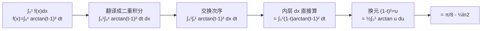

# 错题日记 10 · 高等数学

> 配套 1000 题强化「一元函数积分学的应用（一）」5 题（编号按内容标，非版次号）。Day 2 产出。

| 题 | 主题 | 核心方法 | 状态 |
|---|---|---|---|
| 1 | 反常积分 $2^{-\sqrt{x}}$ | 换元 + 分部 | 🟢 方法备案 |
| 2 | $\int xf(1-x)$ | 换元 + 偶函数消半 | 🟢 方法备案 |
| 3 | 变上限积分求导 | FTC 直接求导，别猜 $f'$ | 🔴 跳步 |
| 4 | 绝对值分段积分 | 三段拆 + 连续性验算 | 🔴 计算错 |
| 5 | $\int f(x)dx$ 算不出 | **二重积分交换次序** | 🔴 没想到 |

---

## 反常积分 $\int_1^{+\infty} 2^{-\sqrt{x}}dx$ — 换元 + 分部

### Question
计算 $\displaystyle\int_1^{+\infty}2^{-\sqrt{x}}\,dx$。

### 正解
令 $\sqrt{x}=t$，$dx=2t\,dt$：
$$\int_1^{+\infty}2t\cdot 2^{-t}\,dt = \frac{-2}{\ln 2}\int_1^{+\infty}t\,d(2^{-t}) \xrightarrow{\text{分部}} \frac{-2}{\ln 2}\Big(t\cdot 2^{-t}\Big|_1^{\infty}-\int_1^{\infty}2^{-t}dt\Big)=\frac{1}{\ln 2}+\frac{1}{\ln^2 2}$$

### Core Concept
**指数型反常积分**：$a^{-t}$ 型 → 分部积分（$t\,d(a^{-t})$），分部后 $t\cdot a^{-t}\to0$（指数衰减碾过多项式增长），余项是 $\int a^{-t}dt$ 直接算。

### 识别信号
被积函数含 $a^{-\sqrt{x}}$ / $a^{-x}$ + 多项式 → 换元去根号 → 分部。

---

## $\int_0^2 xf(1-x)dx$ — 换元 + 偶函数消半

### Question
$f$ 连续偶函数，$\int_0^1 f(x)dx=2$，求 $\int_0^2 xf(1-x)dx$。

### 正解
令 $x=1+t$：
$$\int_{-1}^{1}(1+t)\underbrace{f(-t)}_{f\text{ 偶}}\,dt = \underbrace{\int_{-1}^1 f(t)\,dt}_{\text{偶×1=偶，翻倍}}+\underbrace{\int_{-1}^1 tf(t)\,dt}_{\text{奇×偶=奇，=0}}=2\int_0^1 f(t)dt=4$$

### Core Concept
**对称区间 + 偶函数 → 一招消一半**。换元把区间平移到 $[-1,1]$ 对称区间后，$(1+t)$ 拆成 $1$（偶部分）和 $t$（奇部分），奇部分积分 = 0。

| 步骤 | 操作 |
|---|---|
| 换元 $x=1+t$ | 区间 $[0,2]\to[-1,1]$ 对称化 |
| 利用 $f$ 偶 | $f(-t)=f(t)$ |
| 奇偶分解 | $(1+t)f(t) = \underbrace{f(t)}_{\text{偶}}+\underbrace{tf(t)}_{\text{奇=0}}$ |

---

## 变上限积分求导——别猜 $f'$，直接 FTC 🔴

### Question
$F(x)=\int_{x^2}^{x^2+1}f(t)\,dt$（$x>0$），已知 $f(x^2+1)-f(x^2)=x$，求 $\int_1^2 f(x)\,dx$。

### My Answer
"以为 $f$ 的导数为 $\frac12$，反推 $f(x)$"——跳步。

### Correct Answer
**FTC 直接求导**：
$$F'(x)=2x\cdot f(x^2+1)-2x\cdot f(x^2)=2x\underbrace{[f(x^2+1)-f(x^2)]}_{=x}=2x^2$$
$$F(x)=\frac{2}{3}x^3+C\quad(C=\lim_{x\to0^+}F(x)=\int_0^1 f(t)dt=1)$$
$$\int_1^2 f(x)\,dx=F(1)=\frac{2}{3}+1=\frac{5}{3}$$

### Error Pattern
**从导数值反推 $f$，而不是从积分方程求导**。正确链路：积分方程 → **两边求导（FTC）** → 得到 $F'(x)$ → 积分回去 → 定常数。

| 错误路径 | 正确路径 |
|---|---|
| 猜 $f'=\frac12$ → 反推 $f(x)$（跳步、丢常数） | $F(x)=\int_{a(x)}^{b(x)}f(t)dt$ → FTC → $F'=b'f(b)-a'f(a)$ |

### 识别信号
题面出现 $\int_{a(x)}^{b(x)}f(t)\,dt$ → **立刻 FTC 求导**（$F'=b'f(b)-a'f(a)$），不要猜 $f'$ 的值。

---

## 绝对值分段积分——三段拆 + 连续性验算 🔴

### Question
$f(t)=\int_0^1 t|t-x|\,dx$，求 $\int_{-1}^{2}f(t)\,dt$。

### My Answer
"思路对，计算错。"

### Correct Answer
令 $u=t-x$：$f(t)=t\int_{t-1}^{t}|u|\,du$。按 $|u|$ 的零点 $u=0$（即 $t$ 相对 $[t-1,t]$ 的位置）分段：

| 条件 | $\int_{t-1}^t|u|du$ | $f(t)$ |
|---|---|---|
| $t\geqslant1$ | $\frac12 t^2-\frac12(t-1)^2=t-\frac12$ | $t^2-\frac{t}{2}$ |
| $0<t<1$ | $\frac12(t-1)^2+\frac12 t^2$ | $t^3-t^2+\frac{t}{2}$ |
| $t\leqslant0$ | $\frac12(t-1)^2-\frac12 t^2=-t+\frac12$ | $-t^2+\frac{t}{2}$ |

$$\int_{-1}^{2}f(t)dt=\int_{-1}^0+\int_0^1+\int_1^2=\frac{7}{6}$$

### Error Pattern
**三段框架对，但计算中边界/符号翻车**。验算方法：**$f(t)$ 在分段点 $t=0$ 和 $t=1$ 处应连续**——左右极限不相等就是算错了。

### Fix Plan
含 $|g(x)|$ 的积分：①找 $g(x)=0$ 的点 → 定分段 ②每段去绝对值（正/负）③分段积分 ④**用连续性验算**（分段点左右极限相等）。

---

## $\int_0^1 f(x)dx$ 算不出 → 二重积分交换次序 🔴

### Question
$f'(x)=\arctan(t-1)^2$，$f(0)=0$，求 $\int_0^1 f(x)\,dx$。

### My Answer
"想着用分部积分，怎么都算不出来。"

### Correct Answer
$f(x)=\int_0^x\arctan(t-1)^2\,dt$，所以：
$$\int_0^1 f(x)\,dx=\int_0^1\int_0^x\arctan(t-1)^2\,dt\,dx$$

$$\xrightarrow{\text{交换次序}}\int_0^1(1-t)\arctan(t-1)^2\,dt\xrightarrow{(1-t)^2=u}\frac12\int_0^1\arctan u\,du=\frac{\pi}{8}-\frac14\ln 2$$

### Error Pattern
**分部积分在这题会循环**（$f$ 本身是积分定义的，分部后又冒出一个积分）。正确思路：**把 $\int f(x)dx$ 翻译成二重积分 → 交换次序 → 内层 $dx$ 直接算出 $(1-t)$ → 降维**。

### Core Concept · 维度升降（跨天元技能）

| 天 | 题 | 升降操作 |
|---|---|---|
| Day 1 | 8.6 | **常数 → 定积分**（0 维 → 1 维） |
| Day 1 | 8.8 | **定积分 → 常量**（1 维 → 0 维） |
| **Day 2** | **本题** | **定积分 → 二重积分 → 交换次序**（1 维 → 2 维 → 换序 → 降回 1 维） |

> **元技能**：低维卡住 → 升到高维（翻译成累次/二重积分）→ 利用高维的换序/对称降维打击 → 降回来。**三天碰到三次 = 你的高频盲区。**

### 识别信号
$f(x)=\int_a^x g(t)\,dt$ → 求 $\int_c^d f(x)\,dx$ → **别分部，直接翻译成二重积分交换次序**。

### 变式自测
$f(x)=\int_0^x e^{t^2}\,dt$，求 $\int_0^1 f(x)\,dx$。答：交换次序 $\int_0^1(1-t)e^{t^2}\,dt$（分部也能做，但交换次序更直接）。

---

## 相关链接

- [[积分学强化笔记]]（含参反常积分结论大观）
- [[高数错题日记2]]（Day 1 强化第八章 10 题）
- [[函数极限连续]]（极限/等价无穷小基础）
